# 多智能体协作与演化技术调研报告

> **项目名称**：运维多智能体协作技术研究  
> **承担单位**：中山大学  
> **委托单位**：华为技术有限公司 2012 实验室  
> **报告日期**：2026 年 4 月  
> **文档版本**：v1.0

---

## 摘要

随着云原生架构、大规模微服务系统和智算推理基础设施的快速发展，传统运维模式正面临故障传播链路复杂、可观测数据规模庞大、专家经验难以沉淀复用等挑战。基于大语言模型（LLM）的智能体技术为智能运维（AIOps）提供了新的技术路径，而多智能体协作与持续演化能力则是构建高效、可解释、可验证和自适应运维系统的关键基础。

本报告围绕"多智能体协作"与"智能体演化"两大核心主题，系统梳理了 2023—2026 年间的学术研究、开源框架和工业实践进展。报告首先归纳 LLM 智能体的基础架构、工具使用、规划推理和记忆机制，明确单体智能体在长链路推理、跨信号融合和可控执行方面的能力边界；随后重点分析链式、ReAct、自省、规划驱动、辩论、投票和层级式七类多智能体协作范式，并进一步讨论 OPTIMA、OMAC、AFlow、AgentFlow 等协作结构、提示词、工作流和在线策略优化方法。在智能体演化方面，报告从知识、策略、行为和架构四个维度梳理自演化技术路线，覆盖自监督学习、专家反馈、强化学习、工作流搜索和进化算法等驱动机制。在运维应用层面，报告综述 OpsLLM、MetaKube、Hero、WeRCA 等代表性系统，并结合本项目开发的 AgenticSRE 原型，分析多智能体协作与演化技术在 Kubernetes 集群根因分析、告警压缩和持续学习中的落地方式。

本报告共引用文献 82 篇，涵盖 ACL、NeurIPS、ICLR、AAAI、ICSE、WWW、FSE、SoCC、KDD、IJCAI 等顶级会议、期刊、核心预印本和项目文献库资料。报告最后结合 SOW 要求，给出面向运维场景的技术差距分析、适用场景判断和后续选型建议，为后续实证评估和系统演进提供技术依据。

**关键词**：多智能体系统、大语言模型、智能体协作、自演化智能体、AIOps、根因分析、Kubernetes

---

## 目录

- [第 1 章 引言](#第-1-章-引言)
- [第 2 章 LLM 智能体基础](#第-2-章-llm-智能体基础)
- [第 3 章 多智能体协作技术](#第-3-章-多智能体协作技术)
- [第 4 章 智能体演化技术](#第-4-章-智能体演化技术)
- [第 5 章 多智能体运维（AIOps）应用](#第-5-章-多智能体运维aiops应用)
- [第 6 章 AgenticSRE 系统实践](#第-6-章-agenticsre-系统实践)
- [第 7 章 挑战与未来方向](#第-7-章-挑战与未来方向)
- [第 8 章 总结](#第-8-章-总结)
- [附录](#附录)

---

## 第 1 章 引言

### 1.1 研究背景

#### 1.1.1 云原生与微服务时代的运维挑战

过去十年间，企业 IT 基础设施经历了从单体架构到微服务、从物理机到容器化的深刻变革。Kubernetes 已成为容器编排的事实标准，全球超过 70% 的企业在生产环境中采用了容器化部署 [CNCF Survey, 2024]。一个典型的大规模微服务系统包含数百个相互依赖的服务、数千个 Pod 实例、以及每秒产生 GB 级别的可观测数据（指标、日志、调用链、事件）。

这种架构复杂性带来了三重运维挑战：

1. **故障传播的级联效应**：微服务间的调用链路深度可达数十层，单点故障可能在秒级内扩散为系统级服务中断。传统基于规则的告警系统面对海量告警风暴时，难以在短时间内定位真正的根因。

2. **可观测数据的维度爆炸**：现代微服务系统产生四类关键可观测信号——指标（Metrics）、日志（Logs）、调用链（Traces）和事件（Events）。根因分析需要跨越这四个维度进行关联推理，超出了人类 SRE 工程师的认知带宽。

3. **运维知识的碎片化**：故障诊断高度依赖专家经验，但这些知识往往以隐性知识（tacit knowledge）的形式存在于个别专家的头脑中，难以系统化地积累、传承和复用。

#### 1.1.2 从传统 AIOps 到 LLM 智能体

AIOps（Artificial Intelligence for IT Operations）的概念由 Gartner 于 2017 年提出，经历了从规则驱动、统计学习到深度学习的技术演进。传统 AIOps 方法在特定任务上取得了显著成效——例如基于时间序列分析的异常检测、基于日志模板挖掘的错误识别等——但它们普遍面临以下瓶颈：

- **任务孤立性**：各子任务（告警、日志分析、指标异常检测）使用独立模型，缺乏跨信号的统一推理能力；
- **泛化困难**：模型高度依赖特定场景的训练数据，跨集群、跨系统的迁移能力弱；
- **缺乏推理能力**：统计模型能检测"异常"，但无法解释"为什么异常"，更无法生成修复方案。

2023 年以来，基于大语言模型（LLM）的智能体技术为突破上述瓶颈提供了新思路。LLM 天然具备自然语言理解、跨领域知识整合和链式推理能力，使其能够：（1）理解多种格式的可观测数据；（2）基于上下文进行假设驱动的根因推理；（3）生成可解释的诊断报告和修复建议。然而，单一 LLM 智能体的能力存在明显上限——上下文窗口的长度限制、单次推理的深度限制、以及对专业工具调用的协调困难——促使研究者转向**多智能体协作**架构。

### 1.2 研究动机：多智能体协作与演化

多智能体系统（Multi-Agent System, MAS）的核心理念是将复杂任务分解为多个子任务，由具有不同专业能力的智能体协作完成。在运维场景中，这种分工协作的思路与 SRE 团队的实际工作模式天然契合：

- **指标分析专家**负责查询 Prometheus、检测时间序列异常；
- **日志分析专家**负责搜索 Elasticsearch、提取错误模式；
- **链路追踪专家**负责分析 Jaeger 调用链、定位延迟瓶颈；
- **诊断推理专家**负责综合所有证据、生成根因假设并迭代验证。

在多智能体协作的基础上，**持续演化**能力进一步解决了运维知识积累的核心难题。一个能够从历史故障中学习的多智能体系统，可以在运行过程中不断积累诊断规则、优化推理策略、提升根因定位准确率，实现从"被动响应"到"主动预防"的跨越。

### 1.3 调研范围与方法论

#### 1.3.1 调研范围

本报告的调研覆盖以下三个核心技术领域：

| 领域 | 关键问题 | 代表性技术 |
|------|---------|-----------|
| **多智能体协作** | 多个 LLM 智能体如何高效协作完成复杂任务？ | Chain, ReAct, Debate, Voting, OPTIMA, OMAC |
| **智能体演化** | 智能体如何从经验中学习、持续改进自身能力？ | Self-Evolving Agents, WeRCA, AlphaEvolve |
| **运维 MAS 应用** | 多智能体协作与演化如何落地到 AIOps 场景？ | OpsLLM, MetaKube, Hero, AgenticSRE |

#### 1.3.2 文献检索策略

本次调研采用系统性文献综述方法，检索范围包括：

- **学术数据库**：arXiv, ACM Digital Library, IEEE Xplore, Semantic Scholar
- **顶级会议/期刊**：NeurIPS, ICML, ACL, AAAI, ICSE, FSE, ASE, SoCC, WWW, TOSEM
- **检索关键词**：multi-agent LLM, agent collaboration, self-evolving agent, AIOps, root cause analysis, intelligent operations
- **时间范围**：2023 年 1 月 — 2026 年 4 月
- **筛选标准**：(1) 论文发表于同行评审的会议或期刊；(2) 技术方案具有可复现性；(3) 与运维场景有直接或间接关联

最终纳入分析的文献共计 **82 篇**，其中多智能体协作方向 32 篇、智能体演化方向 18 篇、AIOps 应用方向 22 篇、基础理论 10 篇。

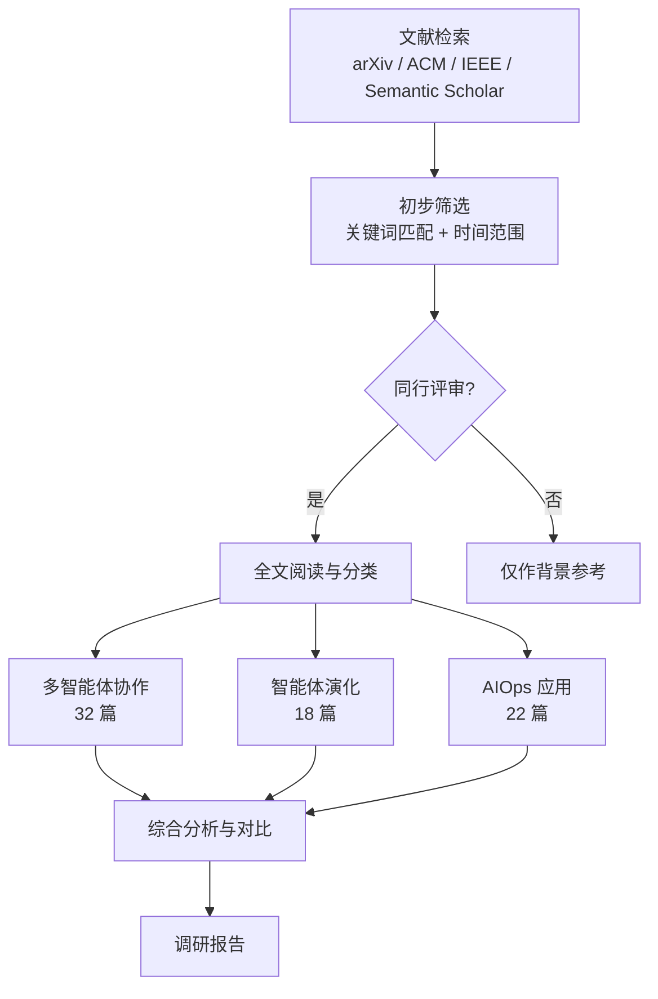

**图 1-1**：文献调研方法论流程

#### 1.3.3 与 SOW 验收要求的对齐

根据《运维多智能体协作技术研究项目 SOW》，本调研报告需要覆盖学术界和工业界关于多智能体记忆、提示词与交互范式构建和优化技术的近三年进展，并深入剖析各技术路线的优缺点、适用场景、局限性以及面向运维领域的差距分析和技术选型建议。为对齐该要求，本文在第 3 章重点分析链式、ReAct、Reflection、Plan-and-Execute、Debate、Voting、Hierarchical 等交互范式，并进一步补充 OPTIMA、OMAC、AFlow、ADAS、GPTSwarm、MASS、Archon、DSPy 和 AgentFlow 等提示词、拓扑、工作流和在线策略优化方法；在第 4 章系统分析记忆、经验学习、专家反馈和强化学习驱动的持续演化机制；在第 5—6 章结合 AIOps 和 AgenticSRE 实践给出运维场景下的落地差距与选型建议。

### 1.4 报告结构导览

本报告共 8 章，结构如下：

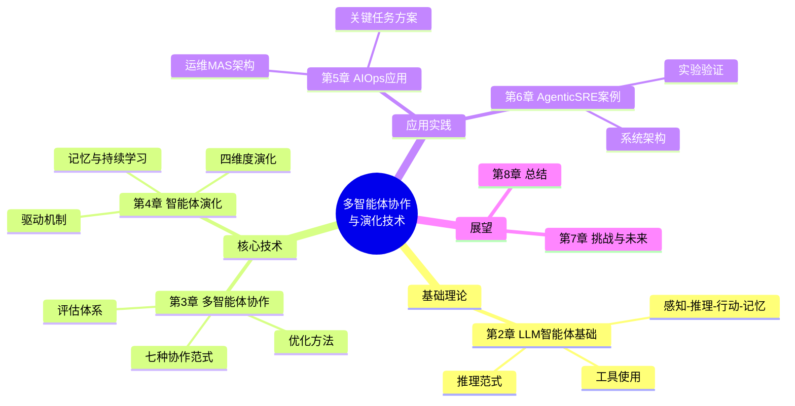

**图 1-2**：报告技术主题关系图

- **第 2 章**：介绍 LLM 智能体的基础架构、推理范式和记忆机制，为后续章节建立概念基础；
- **第 3 章**：系统梳理七种多智能体协作范式，分析 OPTIMA、OMAC 等优化方法，并对比各范式的优劣（**核心章节**）；
- **第 4 章**：从知识、策略、行为、架构四个维度分析智能体演化技术（**核心章节**）；
- **第 5 章**：综述多智能体技术在 AIOps 运维领域的应用现状；
- **第 6 章**：以 AgenticSRE 系统为案例，展示技术落地实践（**核心案例**）；
- **第 7 章**：分析当前挑战并展望未来研究方向；
- **第 8 章**：总结全文主要发现与结论。

上述章节的组织遵循"基础→核心→应用→展望"的逻辑递进关系：第 2 章建立单体智能体的概念基础，第 3 章将其扩展到多智能体协作，第 4 章进一步引入时间维度上的持续演化，第 5—6 章将理论落地到运维实践，第 7—8 章进行反思与展望。每一章的内容都以前一章的结论为出发点，形成完整的技术叙事链条。

---

## 第 2 章 LLM 智能体基础

在深入讨论多智能体协作与演化技术之前，有必要首先建立对单体 LLM 智能体的系统理解。本章从架构设计、工具使用、推理范式和记忆机制四个方面展开分析，并在最后明确指出单体智能体的能力边界——正是这些边界催生了多智能体协作的技术需求。

### 2.1 LLM-based Agent 的核心架构

基于大语言模型的智能体（LLM-based Agent）是指以 LLM 作为核心推理引擎，配备感知、行动和记忆模块，能够自主完成复杂任务的软件实体。与传统的 LLM 对话系统不同，智能体具备**环境交互**能力——它能够感知外部状态、调用工具执行操作、并根据反馈调整策略。

Wang et al. [1] 在其综合调研中将 LLM-based Agent 的架构抽象为四个核心模块。Huang et al. [10] 则专门针对 LLM 智能体的规划能力进行了系统性综述，将规划技术分为任务分解、计划选择、外部模块、反思和记忆五大类。

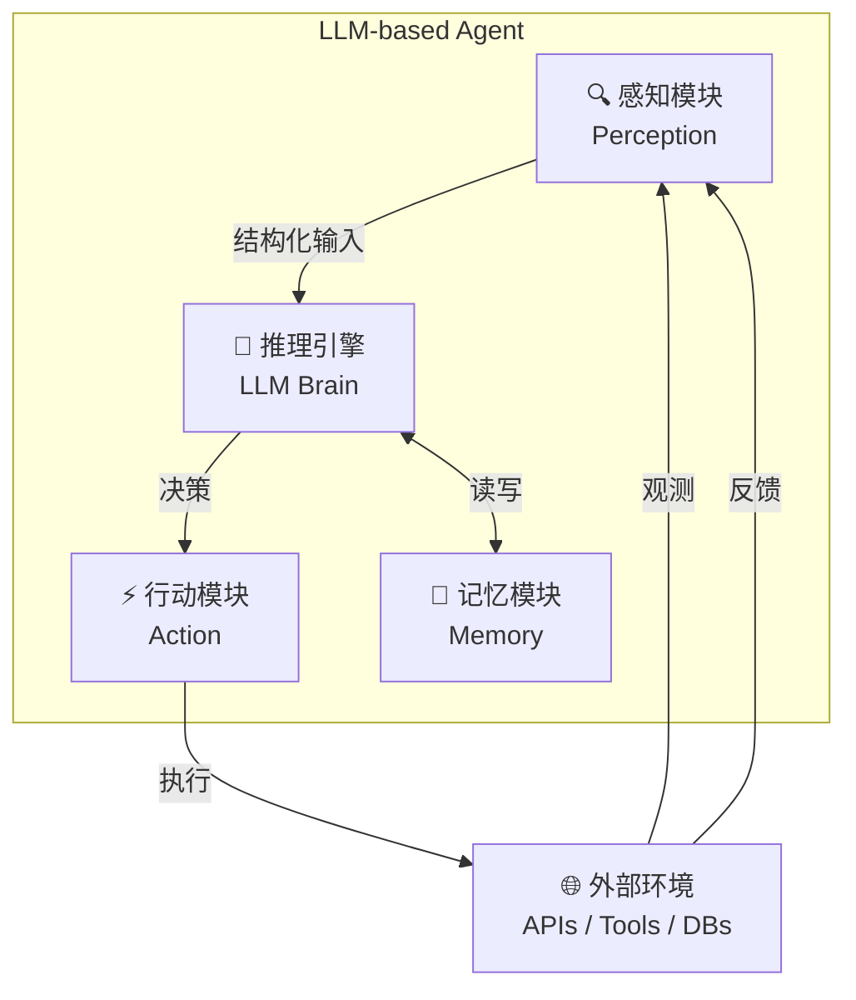

**图 2-1**：LLM Agent 通用架构图

1. **感知模块（Perception）**：负责接收和处理来自外部环境的多模态输入，包括文本（日志、配置文件）、结构化数据（指标时间序列、JSON 格式的 API 响应）以及图像（监控面板截图）。感知模块将原始数据转换为 LLM 可理解的文本表示。

2. **推理引擎（LLM Brain）**：作为智能体的"大脑"，LLM 基于当前输入和历史上下文进行推理、规划和决策。推理引擎的能力直接决定了智能体的任务完成质量。

3. **行动模块（Action）**：将 LLM 的决策转换为具体的环境操作，包括工具调用（API 请求、命令执行）、与其他智能体通信、以及生成最终输出（报告、代码、修复方案）。

4. **记忆模块（Memory）**：存储智能体的历史交互记录、学习到的知识和任务状态。记忆机制使智能体具备从经验中学习和跨任务知识迁移的能力。

### 2.2 工具使用（Tool Use）与环境交互

工具使用是 LLM 智能体从"对话系统"升级为"自主执行系统"的关键能力。通过 Function Calling 或 Tool Use 协议，LLM 能够在推理过程中选择并调用外部工具，从而突破自身知识截止期和计算能力的限制。

在运维场景中，典型的工具包括：

| 工具类别 | 具体工具 | 功能描述 |
|---------|---------|---------|
| **集群管理** | kubectl, K8s API | Pod/Deployment/Service 的查询与操作 |
| **指标查询** | Prometheus API | PromQL 查询、时间序列分析 |
| **日志搜索** | Elasticsearch API | 全文搜索、日志模式聚合 |
| **链路追踪** | Jaeger API | 分布式调用链查询与分析 |
| **异常检测** | Z-score, EWMA | 时间序列异常点检测 |
| **图分析** | PageRank 变种 | 基于服务拓扑的根因定位 |

工具使用的技术实现主要有两种模式：

- **Function Calling 模式**：由 LLM 服务商（如 OpenAI、Anthropic）在 API 层面支持，LLM 在生成过程中产生结构化的函数调用请求，运行时框架负责执行并将结果返回给 LLM。
- **ReAct 模式**：LLM 通过自然语言描述工具调用意图（如 `Action: search_logs("error", namespace="production")`），由外部解析器提取并执行，更灵活但需要额外的输出解析逻辑。

Schick et al. [2] 的 Toolformer 工作首次证明了 LLM 可以自主学习何时以及如何调用外部工具，开启了工具增强智能体的研究方向。

### 2.3 规划与推理范式

LLM 智能体的推理能力直接决定了其在复杂任务中的表现。当前主流的推理范式可分为以下几类：

#### 2.3.1 链式思维（Chain-of-Thought, CoT）

Wei et al. [3] 提出的 CoT 是最基础的推理增强方法。通过在 prompt 中引导 LLM "逐步思考"（Let's think step by step），使其在生成最终答案前显式展开中间推理步骤。CoT 显著提升了 LLM 在数学推理、常识推理等任务上的表现，但其推理过程是**单轮、线性**的，缺乏环境交互和迭代改进的能力。

#### 2.3.2 ReAct：推理与行动的交织

Yao et al. [4] 提出的 ReAct 范式将**推理（Reasoning）**和**行动（Acting）**交织在一个循环中：

```
Thought → Action → Observation → Thought → Action → ... → Conclude
```

每一步中，LLM 先生成推理思考（Thought），基于思考选择一个行动（Action），观察行动结果（Observation），然后据此进行下一轮推理。ReAct 的优势在于动态适应性——智能体可以根据环境反馈实时调整推理方向，但代价是较高的 Token 消耗和潜在的推理循环风险。

#### 2.3.3 Plan-and-Execute：先规划后执行

Wang et al. [5] 提出的 Plan-and-Solve 范式将任务分为两个阶段：

1. **规划阶段**：LLM 分析任务需求，生成一个结构化的执行计划（包含多个子步骤）；
2. **执行阶段**：逐步执行计划中的每个步骤，每步完成后可根据结果动态调整后续计划。

这种"先规划后执行"的策略在多步骤复杂任务中表现优异，尤其适合运维场景中的假设驱动根因分析——先生成候选根因假设，再制定针对性的调查计划。

Yao et al. [7] 提出的 Tree of Thoughts (ToT) 将推理过程建模为一棵搜索树，每个节点代表一个中间推理状态，智能体可以通过广度优先或深度优先搜索来探索不同的推理路径。Besta et al. [8] 进一步提出 Graph of Thoughts (GoT)，将推理结构从树扩展到任意有向图，允许合并不同推理分支的结果，在排序任务上将质量提升 62% 的同时降低了 31% 的成本。Besta et al. [9] 在后续工作中系统性地对比了 CoT、ToT 和 GoT 三种结构，建立了统一的分析框架。

#### 2.3.4 自省式（Reflection）

Shinn et al. [6] 提出的 Reflexion 范式引入了自我反思循环：智能体在完成一轮任务后，对自身的推理过程和结果进行批判性审查，识别不足之处，然后在下一轮中改进。这种"自我批评→改进"的循环使智能体具备了迭代优化的能力。

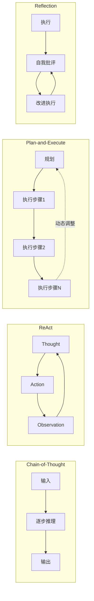

**图 2-2**：主流推理范式对比示意图

### 2.4 记忆机制

记忆是 LLM 智能体实现持续学习和跨任务知识迁移的基础。参考人类认知科学的记忆分类，LLM 智能体的记忆系统通常包含三个层次：

1. **工作记忆（Working Memory）**：对应 LLM 的上下文窗口（Context Window），存储当前任务的即时信息。受限于上下文长度（4K—200K tokens），工作记忆的容量有限。

2. **短期记忆（Short-term Memory）**：通过对话历史管理（如消息队列、滑动窗口）实现，保存近期交互记录。在多轮对话中维持上下文连贯性。

3. **长期记忆（Long-term Memory）**：通过外部存储系统（向量数据库、知识图谱、结构化文件）实现，持久化保存智能体积累的知识、经验和规则。长期记忆是智能体演化的核心载体。

Zhang et al. [42]（ByteDance Seed & 浙大 & 上交，arXiv 2025）提出了 **M3-Agent**，一种配备多模态长期记忆的智能体框架。M3-Agent 通过两个并行过程运作：**Memorization 过程**持续处理实时视频和音频流，生成两类记忆——**情景记忆**（具体事件，如"Alice 拿起咖啡"）和**语义记忆**（通用知识，如"Alice 喜欢在早晨喝咖啡"），并以**实体中心**（entity-centric）的多模态图结构组织（同一人物的人脸、声音和文本知识通过图的边连接）；**Control 过程**接收外部指令后，从长期记忆中检索相关信息，通过 RL 训练的多轮推理（而非单轮 RAG）完成任务。消融实验表明，移除语义记忆导致准确率下降 **17.1—19.2%**，证明了持续的世界知识构建对长期记忆系统的关键价值。这种"感知→记忆→推理"的架构模式对运维场景中的多模态监控（如 Grafana 面板截图自动分析、告警语音交互）具有直接的启发意义。Packer et al. [43] 提出的 MemGPT 将 LLM 的上下文窗口类比为操作系统的主内存，引入分层存储（主内存→召回数据库→向量化归档）管理不同时效性的记忆。Zhao et al. [44] 的 ExpeL（Experiential Learning，AAAI 2024）系统更进一步，提出了一种**无需参数更新**的经验学习方法。ExpeL 的核心思想是：智能体通过试错在一组训练任务上收集成功和失败的执行轨迹，然后通过两种互补的提取策略形成可复用知识——（1）**成功-失败对比提取**：将同一任务的成功轨迹和失败轨迹配对输入 LLM，提取导致成败差异的关键决策点；（2）**成功批量提取**：从一组成功轨迹中提炼共性的最佳实践。提取的洞察（insights）通过 ADD、UPVOTE、DOWNVOTE、EDIT 四种操作动态维护，形成一个不断精炼的知识库 $\hat{\iota}$。在推理时，智能体基于任务相似度（通过 FAISS 向量检索）召回最相关的历史轨迹和提炼的洞察，注入到 ReAct 推理上下文中。实验表明 ExpeL 在多个决策基准上随经验积累持续提升，并展现出跨任务的迁移学习能力。近年的研究 [45, 46, 47] 开始探索将记忆操作本身作为智能体的可调用工具（store、retrieve、update、summarize、discard），通过强化学习训练智能体自主决定何时以及如何管理记忆。其中 A-Mem [45]（NeurIPS 2025）受 Zettelkasten 卡片笔记法启发，为每条记忆生成包含上下文描述、关键词和标签的结构化笔记，并通过分析历史记忆建立语义链接，形成动态互联的知识网络——当新记忆加入时，可触发对已有记忆表示的更新和重组，实现记忆网络的持续自精炼。

- **向量化故障指纹库**：将历史故障的特征向量化存储，支持相似故障的快速检索（如 ChromaDB）；
- **诊断规则库**：从成功的根因分析中自动提炼结构化诊断规则；
- **执行轨迹存储**：记录智能体的推理过程和工具调用序列，供后续分析和优化。

### 2.5 当前 LLM Agent 的能力边界与局限

尽管 LLM 智能体展现了较强的推理和工具使用能力，但当前技术仍存在以下局限：

| 局限性 | 具体表现 | 影响 |
|--------|---------|------|
| **幻觉问题** | LLM 可能生成看似合理但实际错误的推理 | 运维场景中错误诊断可能导致误操作 |
| **上下文窗口限制** | 即使 200K token 的窗口也难以容纳大规模日志 | 需要智能的上下文管理和信息压缩 |
| **工具调用可靠性** | 参数格式错误、调用时机不当 | 需要鲁棒的错误处理和重试机制 |
| **推理深度限制** | 单次推理难以处理需要多步验证的复杂问题 | 需要迭代推理和外部验证机制 |
| **知识时效性** | 模型训练数据有截止期 | 需要 RAG 或实时工具调用补充当前信息 |

**表 2-1**：LLM Agent 当前局限性分析

这些局限性构成了多智能体协作的根本动机——通过任务分解、角色专业化、交叉验证和持续学习来弥补单一智能体的不足。

**表 2-2**：单体 Agent 与多 Agent 系统能力对比

| 维度 | 单体 Agent | 多 Agent 系统 |
|------|-----------|--------------|
| **任务复杂度** | 适合单一领域任务 | 可处理跨领域复杂任务 |
| **上下文管理** | 受限于单个上下文窗口 | 各智能体独立管理上下文 |
| **推理深度** | 单轮推理，容易遗漏 | 多视角交叉验证，更全面 |
| **容错能力** | 单点失败即任务失败 | 部分智能体失败不影响整体 |
| **知识覆盖** | 受限于 prompt 长度 | 各智能体携带专业领域知识 |
| **可扩展性** | 难以扩展 | 可按需增加新的专用智能体 |
| **Token 开销** | 较低 | 较高（多次 LLM 调用） |
| **系统复杂度** | 简单 | 需要编排和通信机制 |

如表 2-2 所示，多智能体系统在任务复杂度、推理深度和容错能力方面具有显著优势，但代价是更高的 Token 开销和系统复杂度。这种权衡促使研究者深入探索不同的多智能体协作范式——如何在保持协作优势的同时，最大化通信效率和任务完成质量？下一章将围绕这一核心问题，系统性地梳理当前主流的七种协作范式及其优化方法。

---

## 第 3 章 多智能体协作技术

前一章分析了单体 LLM 智能体的架构与局限性，得出了"多智能体协作是突破单体瓶颈的必然选择"的结论。然而，多个智能体的简单组合并不等于有效协作——如何设计协作结构、如何管理通信开销、如何聚合多方结果，都是需要系统性解决的技术问题。本章是本报告的核心章节之一，将从协作范式分类、优化技术、通信机制和评估方法四个维度展开深入分析。

### 3.1 多智能体协作的基本范式分类

Tran et al. [11] 在 2025 年发表的综合调研中，提出了一个可扩展的多维度协作机制分析框架，将 LLM-based MAS 的协作从五个关键维度进行刻画：**参与者**（actors，涉及哪些智能体）、**类型**（types，合作/竞争/协竞）、**结构**（structures，集中式/去中心化/层级式）、**策略**（strategies，规则驱动/角色驱动/模型驱动）、以及**协调协议**（coordination protocols）。该调研通过系统分析指出了一个重要发现：LLM 本质上是作为独立算法训练的，并非专门为协作任务设计，这使得多智能体协作的机制设计面临理论和实践双重挑战——智能体行为难以向利益相关者解释或预测。

在协作类型维度上，Tran et al. 将多智能体交互归纳为合作、竞争和协竞三种基本形态。合作型 MAS 要求各智能体把个体目标 $o_i$ 对齐到集体目标 $\mathcal{O}_{collab} = \bigcup_{i=1}^{n} o_i$，通过互补技能完成单一智能体难以覆盖的复杂任务；竞争型 MAS 则允许智能体围绕不同假设或策略相互质询，通过辩论、对弈或裁判机制推动答案质量提升；协竞型 MAS 介于二者之间，在共享任务上合作，在局部决策上竞争。运维 RCA 大多数时候属于合作型任务，但在根因假设存在冲突时需要引入有限竞争机制，例如让应用层视角和基础设施视角分别给出解释，再由 JudgeAgent 基于证据充分性进行裁决。

在通信结构维度上，该调研识别出集中式、去中心化和层级式三类主要拓扑。集中式拓扑把决策集中于一个编排节点，实现简单且便于审计，但中央节点能力不足时容易成为瓶颈；去中心化拓扑使多个智能体平等交换信息，容错性更强，但会显著增加通信开销和状态同步复杂度；层级式拓扑在管理者与工作者之间划分职责，适合大规模任务分解。对生产运维系统而言，纯去中心化结构难以满足可控性要求，集中式或层级式结构更符合 SRE 对审计、回滚和责任边界的要求。

Guo et al. [12]（arXiv 2024）则从应用前沿的角度综述了 LLM-based MAS 的近三年进展，将推理框架归纳为三类——**多阶段框架**（multi-stage，智能体作为流水线各阶段的串行求解器，如 ChatDev）、**集体决策框架**（collective decision-making，多个智能体对同一目标投票或辩论）、**自精炼框架**（self-refine，引入自反思机制迭代改进输出）。该调研同时指出 MAS 通信优化的两个方向：**速度优化**（如非语言通信、更短的生成）和**分布式讨论**（在信息不完整的条件下协作求解）。此外，Guo et al. 探索了 MAS 中的规模定律，发现智能体数量与协作效果之间**不存在显著的正相关模式**——简单增加智能体数量并不能保证性能提升。Li et al. [13]（IJCAI 2024）进一步从进展与挑战两个维度展开分析。Luo et al. [14]（arXiv 2025）的综合调研则强调了检索增强工具使用、反思改进多智能体协作、以及推理能力对所有类别的增益效应。结合上述文献调研和本项目的研究实践，我们将多智能体协作范式归纳为七种基本类型：

#### 3.1.1 链式串行（Chain / Sequential Pipeline）

链式协作是最简单、也最容易工程化的多智能体协作范式。系统预先规定智能体执行顺序，前一个智能体的输出直接成为后一个智能体的输入上下文。其本质是把复杂任务拆成一条确定的处理流水线，类似传统软件工程中的 ETL 或 CI/CD pipeline。

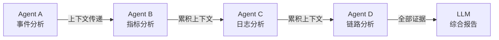

链式范式的优势在于确定性和可复现性：只要输入、模型版本和工具返回结果一致，执行路径就基本可预测，便于调试和审计。它也最容易与企业现有 SOP 对齐，例如先检查 K8s 事件，再看资源指标，再查日志，最后补充调用链证据。其代价同样明显：所有智能体串行等待，端到端延迟较高；早期智能体如果给出错误摘要，会把偏差传递到后续环节；当中间证据显示原计划不合适时，流水线自身缺乏动态转向能力。因此，链式范式适合故障类型较明确、证据采集顺序稳定、对延迟要求不极端的简单场景，可作为 AgenticSRE 的低成本基线，而不宜作为复杂未知故障的默认策略。代表性工作包括 ChatDev [18] 中的软件开发流水线（需求分析→设计→编码→测试→部署），每个阶段由专门的智能体角色完成。

#### 3.1.2 反应式循环（ReAct Loop）

ReAct Loop 将"推理-行动-观察"循环扩展到多智能体场景，由中央推理智能体在每一步根据当前证据动态选择要调用的专用智能体。与链式范式相比，它不预先固定调查路径，而是把调查过程视为逐步探索。

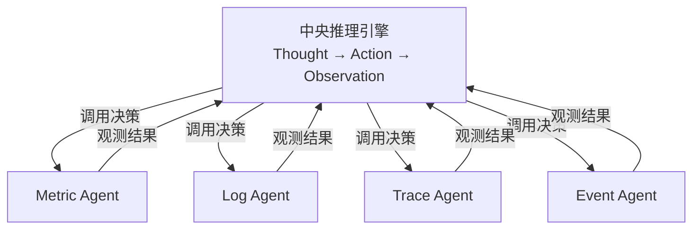

该范式的价值在于适应性。若日志中出现连接池耗尽线索，中央推理器可以立即转向数据库指标或配置变更；若链路追踪发现异常只集中在特定调用边，则可以跳过无关服务的全量扫描。ReAct 因此适合初始信息不足、需要边查边判断的未知故障。但它也暴露出生产系统最敏感的两个问题：一是 Token 开销随轮数线性上升，每一轮都要携带足够上下文才能保持推理连贯；二是循环终止依赖模型判断，容易出现重复查询、无效工具调用或过早结论。Yao et al. [4] 的原始 ReAct 论文在知识密集型推理任务和交互式决策任务上验证了该范式的有效性，但在运维场景中应增加最大步数、证据充分性检查和 JudgeAgent 终止条件，避免探索失控。

#### 3.1.3 自省式（Reflection / Self-Critique）

自省式协作引入"批评者"或"复核者"角色，对初始分析结果进行审查，再驱动补充调查或报告修订。它的核心假设是：初始诊断往往遗漏证据或存在逻辑跳跃，而一个独立的批评过程可以显式发现这些缺陷。

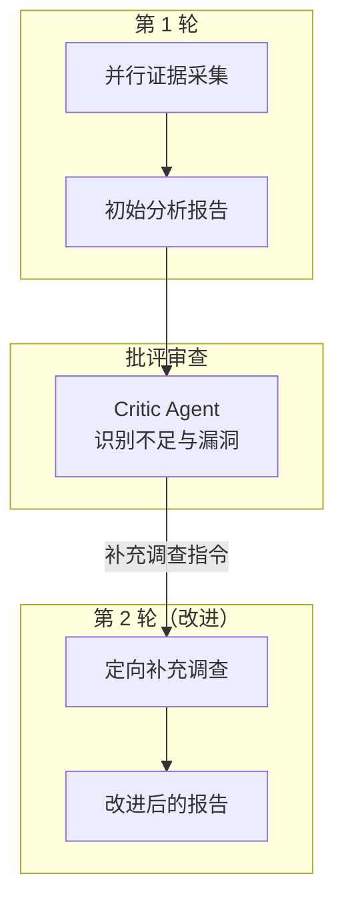

自省机制的主要收益是质量保障。它可以要求 Critic Agent 检查根因是否有直接证据支持、是否存在未排除的竞争假设、修复建议是否与权限和变更窗口冲突。在运维报告生成中，这种机制尤其适合 P0/P1 事故复盘和变更前风险评审。需要注意的是，批评者本身也可能产生幻觉，甚至为了完成"批评"任务而提出无价值的补充要求。因此自省轮数通常应限制在 2—3 轮，并且批评意见必须转化为可执行的证据采集任务，而不能停留在抽象文字层面。Shinn et al. [6] 的 Reflexion 框架证明了自省机制能够显著提升智能体在编程、推理等任务上的表现，最多可将成功率提高约 20%。

#### 3.1.4 规划驱动（Plan-and-Execute / Hypothesis-Driven）

规划驱动范式将 RCA 建模为"假设生成→调查规划→证据采集→假设验证"的结构化过程。与 ReAct 的开放式探索不同，规划驱动方法先显式列出候选根因，再为每个候选根因设计能够支持或反驳它的调查步骤，更接近 SRE 团队实际排障中的科学实验流程。

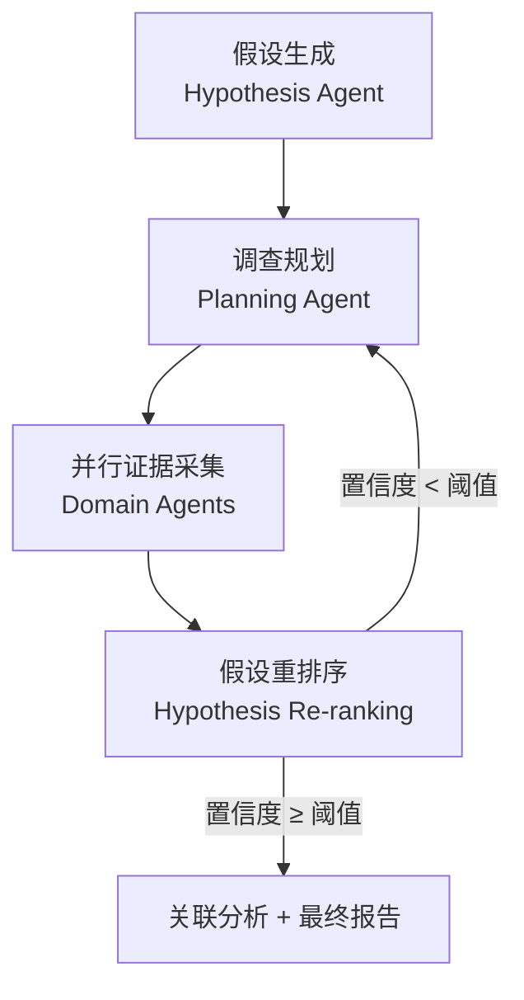

该范式的优势在于可追溯和可收敛。每一轮调查都能说明其服务于哪个假设、预期看到什么证据、实际观测如何改变置信度，因此适合用于需要审计的企业运维场景。它还能避免无目标扫描：如果候选根因是 CPU throttling，MetricAgent 就优先查询 CFS throttling、CPU usage、request latency，而不是盲目拉取所有指标。局限在于初始假设质量决定上限；如果真正根因不在候选集合中，系统需要通过低置信度、矛盾证据或 JudgeAgent 反馈触发假设扩展。本项目开发的 AgenticSRE 系统采用此范式作为默认协作模式（详见第 6 章），原因正是它在可解释性、并行效率和证据闭环之间取得了较稳健的平衡。

#### 3.1.5 多视角辩论（Debate / Multi-Perspective Discussion）

辩论式协作让多个分析智能体从不同视角解释同一组证据，再由裁判智能体综合各方观点。它不是简单复制多个相同模型，而是刻意引入视角差异，例如基础设施视角关注节点、网络和资源限制，应用视角关注代码、依赖和配置，全局视角关注跨服务传播链。

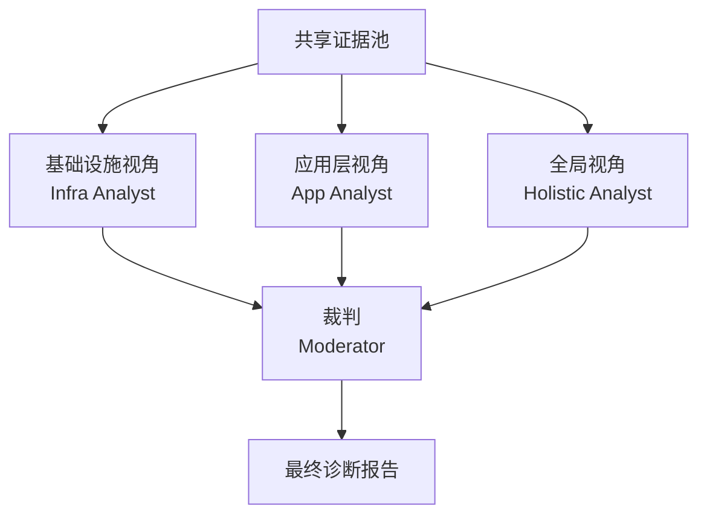

辩论的价值来自多样性，而不是轮数本身。不同角色能够捕获不同层面的信号，减少单一视角过度自信。例如同样是 HTTP 5xx 暴增，应用智能体可能认为是代码异常，基础设施智能体可能指出上游依赖超时，全局智能体则可能发现二者都由一次配置发布触发。需要警惕的是，Chen et al. [23]（NeurIPS 2025）从理论上证明，辩论过程构成一个鞅，单纯增加辩论轮次并不能提高预期正确率；真正有效的是引入投票、偏置更新、证据权重或裁判机制。Chen et al. [24] 的 ReConcile 通过圆桌讨论和共识投票提升推理质量，也说明辩论必须与聚合机制配合使用。对运维而言，Debate 应用于跨层复杂故障和高风险报告复核，不宜作为默认低成本路径。

#### 3.1.6 集成投票（Ensemble Voting）

投票式协作通过多次独立分析和多数投票聚合提高结果鲁棒性。它既可以使用同一模型不同 temperature 的采样，也可以使用不同模型或不同提示词产生候选诊断，再由多数投票、置信度加权或裁判模型选择最终结论。

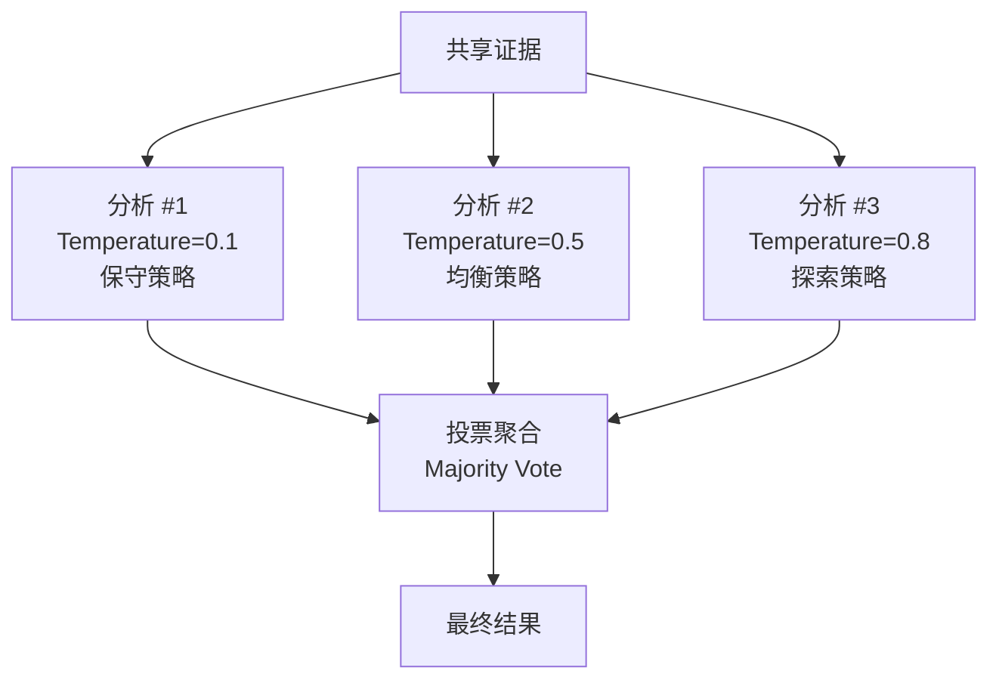

投票的工程优势是简单：各次分析彼此独立，不需要复杂通信协议，也不容易出现多轮对话中的状态污染。它适合用于关键系统事故的最终复核，例如对前三个候选根因进行独立裁决，以降低单次 LLM 随机性的影响。其不足在于成本随采样次数线性增长，并且多数投票只能在已有答案中选择，无法天然生成更优综合答案。对于证据复杂、多个候选根因互相依赖的事故，投票应与 Critic/Fuser 结合，而不是仅做简单多数决。

#### 3.1.7 层级式（Hierarchical / Manager-Worker）

层级式协作模仿人类组织的管理结构，由管理者智能体负责任务分解、优先级控制和结果汇总，工作者智能体负责具体数据采集和局部分析。它特别适合智能体数量较多、工具类型复杂、需要集中审计的企业系统。

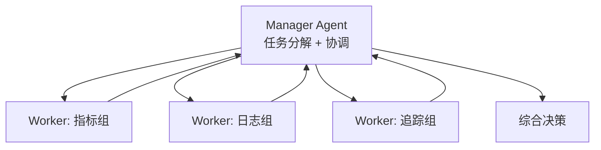

层级式结构的可扩展性较好：新增网络分析、GPU 分析或数据库分析智能体时，只需扩展 Manager 的任务路由和结果汇总逻辑，不必重写所有角色之间的通信协议。它的主要风险是管理者成为瓶颈，尤其当 Manager 需要同时理解所有领域证据并做最终裁决时，模型能力和上下文治理会限制系统上限。层级过深还可能导致信息损失，因此生产系统通常宜采用两层或三层结构，而不是无限制细分。代表性工作包括 MetaGPT [19] 的软件公司模拟（CEO→产品经理→架构师→工程师）和 AutoGen [20] 的灵活层级式智能体编排。Gao et al. [33] 提出的 AgentScope 进一步提供了一个灵活且健壮的多智能体平台，支持多种协作拓扑的快速实现与对比。在工业实践中，Amazon 的 Insight Agents [28]（SIGIR 2025）展示了层级式架构在生产环境中的成功应用：Manager Agent 负责域外检测、查询路由和查询增强，两个 Worker Agent 分别处理表格数据检索和领域知识注入的诊断分析；该系统在 Amazon US 电商卖家平台上线，实现了 **89.5%** 的准确率和 **P90<15s** 的响应延迟。

### 3.2 协作优化技术

原始的多智能体协作往往面临通信效率低下、Token 消耗过大、任务完成质量不稳定等问题。近年来，研究者提出了多种协作优化方法。

#### 3.2.1 OPTIMA：拓扑优化与通信修剪

Chen et al. [15]（ACL 2025 Findings）提出了 OPTIMA 框架，旨在同时优化 LLM-based MAS 的**效率（efficiency）**和**效果（effectiveness）**。OPTIMA 采用迭代式 **Generate → Rank → Select → Train** 四阶段范式。其核心创新在于设计了一个复合奖励函数，同时平衡三个优化目标：

$$R(\tau_i^j) = R_{\text{task}}(\tau_i^j) - \lambda_{\text{token}} R_{\text{token}}(\tau_i^j) + \lambda_{\text{loss}} \frac{1}{R_{\text{loss}}(\tau_i^j)}$$

其中 $R_{\text{task}}$ 衡量任务完成质量，$R_{\text{token}}$ 惩罚冗余的 Token 消耗（鼓励简洁通信），$R_{\text{loss}}$ 基于基座模型的语言建模损失来正则化输出的自然度和可读性。OPTIMA 的核心技术包括三个层面：

1. **通信拓扑优化**：在全连接、星型、环形等拓扑结构之间自动搜索更合适的通信模式。实验表明，全连接拓扑并不总是最佳选择——适度的通信稀疏性反而能减少冗余信息干扰。

2. **消息修剪（Communication Pruning）**：基于消息的信息增益估计，自动过滤低价值的通信内容，实验中节省了高达 **88.5%** 的 Token 消耗。

3. **迭代训练**：OPTIMA 探索了三种训练实例化方案——迭代 SFT（iSFT，从高质量轨迹学习）、迭代 DPO（iDPO，从轨迹对比中学习偏好）、以及两者交替的混合方案（iSFT-DPO）。在 DPO 数据生成环节，OPTIMA 创新性地引入了 **MCTS（蒙特卡洛树搜索）**启发的方法——将多智能体对话的每个轮次建模为搜索树的一个节点，通过展开（Expansion）→模拟（Simulation）→回溯（Backpropagation）→迭代（Iteration）四步生成高质量的偏好对比数据。

基于 Llama 3 8B 的实验表明，OPTIMA 在信息交换、信息不对称问答和复杂推理等任务上，相比单智能体基线和原始 MAS，一致性地实现了 **2.8 倍性能提升**，同时 Token 消耗最多减少约 **90%**。这一结果有力地证明了"通过训练优化通信效率"是一个极具前景的研究方向。

为直观理解 OPTIMA 的效果，考虑一个运维场景的类比：传统的全连接拓扑下，4 个领域智能体（指标、日志、追踪、事件）在每轮交互中都会互相交换全部分析结果，产生 $4 \times 3 = 12$ 条消息。OPTIMA 的通信修剪发现，实际上事件智能体的输出对日志智能体几乎没有信息增益，可以安全地剪枝掉这条通信链路。经过优化后，12 条消息可能被缩减为 5—6 条，Token 消耗大幅下降而任务准确率基本不变。

#### 3.2.2 OMAC：系统化优化框架

OMAC（A Broad Optimization Framework for LLM-Based Multi-Agent Collaboration）[16]（UT Austin & Intuit，arXiv 2025）提出了一个面向多步协作过程的**全局优化框架**，识别出五个关键优化维度——两个功能维度（**Fun-1**：优化现有智能体的 prompt 和 few-shot 示例；**Fun-2**：为协作流程构建新的专用智能体）和三个结构维度（**Str-1**：优化候选智能体团队组成；**Str-2**：在每个协作步骤中动态选择参与的智能体子集；**Str-3**：优化智能体间的通信机制）。OMAC 的核心算法包含两个 LLM 驱动的角色：**语义初始化器**（Semantic Initializer，利用 LLM 的知识在相关语义空间中生成初始候选配置）和**对比比较器**（Contrastive Comparator，从高性能-低性能配置对中进行对比推理，识别性能差距的根因并生成改进方案）。该框架不仅支持五个维度的独立优化，还支持跨维度的联合迭代优化，在通用推理、代码生成和算术推理任务上一致性地超越现有方法，可以从以下维度系统性地优化多智能体协作：

- **角色定义优化**：自动生成和调整智能体的角色描述和系统提示词
- **通信协议优化**：设计高效的消息格式和通信频率
- **任务分解优化**：学习更合适的子任务划分策略
- **集成策略优化**：确定更合适的结果聚合方式

OMAC 的核心思想是将多智能体协作视为一个可优化的系统，通过搜索或学习来找到高质量配置。

#### 3.2.3 文本反馈驱动的协作优化

Dong et al. [17]（ASU & Amazon，COLM 2025 Workshop）探索了利用自然语言反馈来优化角色式多智能体系统的方法。针对软件开发场景，该工作提出了一个**两步优化流水线**：第一步通过 LLM-based locator 定位表现不佳的智能体，结合其角色定义和自然语言反馈生成细粒度的失败解释；第二步利用 LLM-based optimizer 基于这些解释优化对应智能体的系统提示词。该工作系统性地对比了四种优化策略组合：在线 vs 离线收集反馈、个体 vs 群体优化智能体。实验结论表明，**在线 + 群体优化**（智能体在优化过程中与环境实时交互、且所有智能体在每步同时优化）是最有效的组合，而 one-pass 和 multi-pass prompting 之间无显著差异——可选择前者以提高效率。这一发现对运维多智能体系统的实际部署具有直接指导意义：应优先采用在线式的整体优化策略。

#### 3.2.4 工作流、拓扑与提示词联合优化

除单纯优化通信拓扑或单个智能体 prompt 之外，2024—2026 年的一条重要技术路线是将多智能体系统整体视为可搜索、可编译或可训练的程序。AFlow、ADAS、GPTSwarm、MASS、Archon 和 DSPy 分别覆盖了从"固定流程内编译 prompt"到"自动生成系统代码"的不同自动化强度。

**DSPy** [76] 将 LLM 应用开发抽象为可编译的声明式程序。开发者不再直接维护长 prompt 模板，而是声明 signature、module、metric，由 teleprompter 自动为每个模块生成 instruction、few-shot 示例或微调数据。论文中的两个案例覆盖数学推理、多跳问答、RAG 和 agent loop，显示 DSPy 可在数分钟到数十分钟编译内，把 GPT-3.5 和 Llama2-13B-chat 的简单程序从 33%/9% 等低基线提升到 82%/47% 等可用水平。对 AgenticSRE 而言，DSPy 更适合放在工程最内层：例如针对 MetricAgent 的 PromQL 生成、LogAgent 的日志模板解释、TraceAgent 的调用链归因分别定义可评测 signature，再用项目私有故障集编译 prompt。它的边界也很清楚：DSPy 默认不负责发明新的跨 Agent 拓扑，因此不应替代系统级编排设计。

**AFlow** [77] 将智能体工作流优化形式化为代码表示的 workflow search。一个 workflow 由多个 LLM 调用节点、代码边和可复用 operator 组成，operator 包括 Generate、Format、Review & Revise、Ensemble、Programmer、ScEnsemble 等。AFlow 使用 MCTS 在搜索树上执行软混合概率选择、LLM 扩展、执行评估和经验回传；评测函数可来自单元测试、任务准确率、F1 或 pass@1。论文在 HumanEval、MBPP、MATH、GSM8K、HotpotQA 和 DROP 六个 benchmark 上验证，平均较人工设计 workflow 提升 5.7%，较已有自动 workflow 优化方法提升 19.5%，并在 HumanEval 上让较小模型以 GPT-4o 约 4.55% 的推理成本达到或超过其 IO 基线。其对 SRE 的启示是：RCA 工作流中的"先查变更还是先查指标"、"是否增加代码执行/PromQL 验证节点"、"何时做结果复核"可以作为离线可搜索对象；但必须先构造可重复的故障注入评测集，否则 MCTS 只会优化到噪声指标。

**ADAS** [78] 进一步将搜索空间扩展到完整智能体系统代码。它提出 Meta Agent Search：元智能体从一个不断增长的 archive 中读取历史 agent 设计、生成新的 Python `forward()` 逻辑、经过自反思与执行调试后加入 archive。该方法在 ARC、DROP、MGSM、MMLU 等任务上发现了可迁移的 agent 结构，例如在 DROP 上提升 F1 13.6/100、在 MGSM 上提升准确率 14.4%，并且从数学任务迁移到 GSM8K/GSM-Hard 后仍分别取得 25.9% 和 13.2% 的准确率增益。ADAS 的价值在于探索人工未预设的新架构，风险也最大：生成代码可能引入隐式工具调用、不可审计循环或越权操作。因此在运维系统中只能作为离线架构探索与对照实验工具，候选设计必须经过静态审查、沙箱执行和人工评审后才能进入灰度。

**GPTSwarm** [79] 提供了一种更结构化的表示：把语言智能体系统统一为计算图，节点是 LLM 推理、工具调用或函数操作，边定义信息流；多个 agent 图再组合成 swarm。优化分为两类：节点优化用于改写节点 prompt，边优化用于学习 agent 间的通信连接。论文使用连续化的 DAG 分布和 REINFORCE 类优化方法，在 MMLU、Mini CrossWords、HumanEval 和 GAIA 上验证了图连接学习的效果。它对运维多智能体的意义在于可以显式表达"指标→日志→追踪→修复建议"的信息流，并通过故障样本学习哪些边应被削弱或剪枝；不足是训练成本和数据需求较高，更适合在仿真故障平台或历史工单回放环境中使用。

**MASS** [80] 关注 prompt 与 topology 的联合优化。论文的重要发现是：多智能体系统中 prompt 常常比盲目增加 agent 数量更具影响力，因此应先优化单个拓扑 block 内的 agent，再搜索 workflow 拓扑，最后对最佳拓扑做全局 prompt 优化。其三阶段流程为：（1）block-level prompt optimization，分别优化 Aggregate、Reflect、Debate、Summarize、Tool-use 等模块；（2）workflow topology optimization，在经过裁剪的拓扑空间中搜索组合；（3）workflow-level prompt optimization，在已选拓扑上联合优化所有 agent prompt。实验显示 MASS 在推理、多跳理解和代码生成任务上显著超过手工 MAS、单智能体 APO 和若干自动生成方法。对 AgenticSRE 来说，MASS 的工程路线更稳健：先把"聚合、反思、辩论、工具执行"等模块做成白名单组件，再在这些组件之间搜索组合，而不是让系统任意生成新代码。

**Archon** [81] 则从推理时架构搜索角度切入。它将 Generator、Fuser、Critic、Ranker、Verifier、Unit Test Generator/Evaluator 等 inference-time technique 作为可组合模块，在给定模型池和推理预算下用贝叶斯优化搜索架构。论文表明，不同任务需要不同模块组合：Fuser 对多候选融合普遍有效，Critic 可帮助 Fuser 利用候选答案的优缺点，Ranker 更适合指令遵循和风格排序，Verifier 与 Unit Test 更适合推理和代码任务。Archon 在多类 instruction-following、reasoning 和 coding benchmark 上平均超过 o1、GPT-4o、Claude 3.5 Sonnet 等前沿模型 15.1%，同时较其他 inference-time 架构减少 20.0% 推理调用、15.1% 输入 token 和 13.5% 输出 token。对生产运维部署，Archon 更像"预算感知的推理编排器"：在高优先级 P0/P1 事故中启用多模型融合和验证，在低优先级告警中选择低成本单模型路径。

对运维多智能体系统而言，这一类方法的价值在于把"选择哪种协作范式、如何设置 prompt、哪些智能体参与、通信边如何连接"从手工经验转为可度量优化。但其落地需要满足三个前提：（1）有稳定的公开或私有 benchmark，例如 OpenRCA、AIOpsLab、ITBench 或项目自建故障注入集；（2）评价指标同时覆盖 RCA 准确率、召回率、端到端耗时、Token 成本和安全违规率；（3）优化结果经过人工审查后再进入生产，避免自动搜索生成不可解释或不可回滚的运维行为。

**表 3-0**：工作流/拓扑/提示词优化方法对比

| 方法 | 优化对象 | 搜索/学习机制 | 优势 | 局限 | 运维适配建议 |
|------|----------|---------------|------|------|--------------|
| DSPy [76] | Prompt、示例、模块调用参数 | Teleprompter / 贝叶斯优化 | 工程成熟，适合固定流程 | 不自动设计拓扑 | 用于 Metric/Log/Trace 等单 Agent prompt 调优 |
| AFlow [77] | 动态工作流和提示词 | MCTS + 运行反馈 | 可发现复杂流程 | 评测成本高 | 离线搜索 RCA 工作流候选 |
| ADAS [78] | 完整智能体系统代码 | 元智能体迭代生成与反思 | 灵活性较高 | 安全审查难 | 作为离线架构探索，不直接在线自改 |
| GPTSwarm [79] | 智能体图拓扑和节点行为 | 强化学习 | 端到端结构学习 | 训练成本高 | 适合有大量仿真故障样本时使用 |
| MASS [80] | Prompt + Topology | 分阶段启发式搜索 | 效率与性能平衡 | 依赖预定义模块 | 适合优化 AgenticSRE 六范式组合 |
| Archon [81] | 推理时模块组合与配置 | HPO / TPE / 贝叶斯优化 | 预算感知、稳定 | 受限于搜索空间 | 用于成本/延迟受限的部署选型 |

#### 3.2.5 AgentFlow：执行流中的可训练规划器

AgentFlow [82] 提出了一种与上述"离线搜索工作流"不同的路线：不是在部署前一次性搜索更优工作流，而是在多轮工具调用的真实执行流中直接优化规划器。其系统由 Planner、Executor、Verifier、Generator 四个模块组成，共享一个显式演化记忆；每一轮由 Planner 产生子目标、选择工具和上下文，Executor 执行工具调用，Verifier 判断执行结果和记忆是否足以结束，最后由 Generator 生成答案。

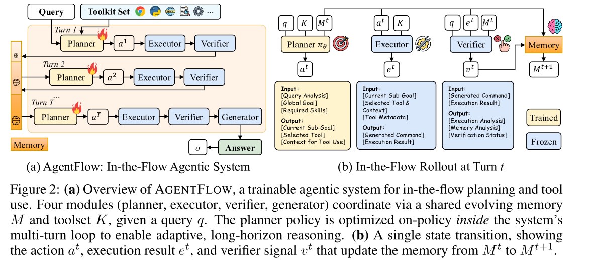

**图 3-1**：AgentFlow 的可训练多模块架构与单轮状态转移（来源：AgentFlow [82]）

该框架的关键贡献是 **Flow-GRPO**：在完整多轮轨迹上采样同一问题的多组 rollout，用最终可验证结果作为轨迹级奖励，并将该奖励广播到每个规划轮次，配合组归一化优势更新规划器。这样做把稀疏、长链路、多模块协作的强化学习问题，转化为一系列在真实记忆状态上的单轮策略更新，缓解了长 horizon credit assignment 难题。

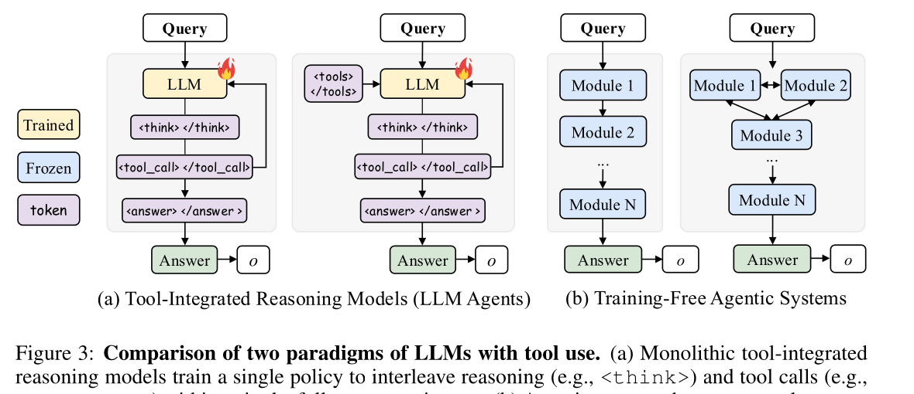

**图 3-2**：传统单体工具调用模型与免训练多模块 Agentic System 的对比（来源：AgentFlow [82]）

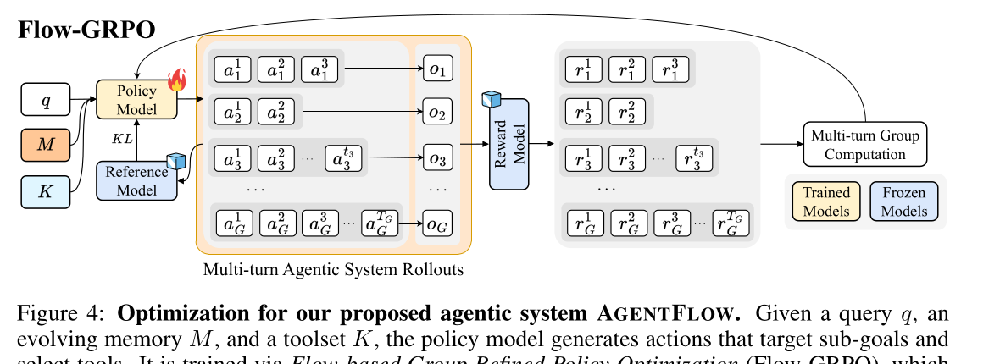

**图 3-3**：Flow-GRPO 在多轮 Agentic System rollout 上优化 Planner（来源：AgentFlow [82]）

AgentFlow 的实验证明，在搜索、Agentic、数学和科学推理等 10 个 benchmark 上，7B 级 backbone 经 Flow-GRPO 后分别获得约 14.9%、14.0%、14.5% 和 4.1% 的平均准确率增益。对运维场景的启示是：如果 AgenticSRE 未来积累了足够多的可验证 RCA 轨迹，可以优先训练 PlanningAgent 而非全量训练所有 Agent。Planner 是协作系统中最靠近任务分解、工具选择和调查顺序的关键瓶颈，优化它能直接减少无效工具调用、重复查询和错误循环。但该路线也要求高质量奖励函数，例如根因是否命中、证据是否支持、修复是否验证成功，以及是否触犯安全策略；缺少可验证奖励时，不宜盲目在线 RL。

### 3.3 协作通信机制

多智能体系统中的通信机制决定了信息如何在智能体之间流动。主要的通信模式包括：

| 通信模式 | 描述 | 优势 | 劣势 | 典型应用 |
|---------|------|------|------|---------|
| **消息传递** | 智能体之间直接发送结构化消息 | 灵活、精确 | 需要定义消息格式 | CAMEL [21] |
| **共享黑板** | 所有智能体读写一个共享状态空间 | 信息共享充分 | 竞争冲突、信息过载 | AgenticSRE 证据池 |
| **广播** | 一个智能体的输出广播给所有其他智能体 | 信息传播快 | 冗余通信多 | 辩论范式 |
| **发布-订阅** | 智能体订阅感兴趣的事件类型 | 解耦、可扩展 | 实现复杂 | 事件驱动架构 |
| **层级上报** | 工作者向管理者汇报，管理者向上汇总 | 结构清晰 | 信息逐级压缩可能丢失细节 | MetaGPT [19] |

### 3.4 角色分配与任务分解策略

在多智能体系统中，角色分配和任务分解的质量直接影响协作效果。

**静态角色分配**：在系统设计时预定义每个智能体的角色和能力，如 AgenticSRE 中的 MetricAgent、LogAgent、TraceAgent 等。优点是确定性高、易于理解和调试；缺点是灵活性不足。

**动态角色分配**：由管理者智能体在运行时根据任务需求动态分配角色。例如，对于网络相关的故障，动态增加网络分析专家的权重。Generative Agents [22]（Park et al., 2023）展示了智能体可以自主发展和调整其角色行为。Wang et al. [32] 的 Voyager 进一步证明了开放世界环境中智能体可以通过持续探索自主扩展其能力边界。

**任务分解策略**：
- **功能分解**：按功能维度划分，每个智能体负责一种分析类型（指标/日志/追踪/事件）；
- **层次分解**：按系统层次划分（基础设施层/平台层/应用层）；
- **假设分解**：按根因假设划分，每个智能体负责验证一个假设。

### 3.5 多智能体系统评估方法

#### 3.5.1 MultiAgentBench 评估框架

MultiAgentBench [25]（UIUC，ACL 2025 长文，又名 MARBLE）提出了一个评估 LLM 智能体在协作与竞争场景中表现的综合基准框架。MARBLE 覆盖 6 种多样化交互场景（Research、Coding、Minecraft、Database、Werewolf、Bargaining），不仅评估任务完成度，还通过创新的 **milestone-based KPI** 追踪里程碑进度和个体贡献，系统性地衡量规划质量和通信效果。该框架支持多种协调协议拓扑（star、chain、tree、graph），实验发现 **graph 结构在 Research 场景中表现较优**，且引入**认知规划**（cognitive planning）可提升 3% 的里程碑达成率。

MARBLE 的实验揭示了几个重要发现：（1）gpt-4o-mini 在平均任务分数上表现最好；（2）智能体开始展现**涌现社会行为**（emergent social behaviors）——研究者称之为"aha-moments"，为 AGI 级别的协作提供了初步线索；（3）多智能体协作存在两种互补的扩展路径——**认知扩展**（cognitive scaling，通过动态架构适配和自组织策略提升单个智能体的推理质量）和**群体扩展**（population scaling，通过增加智能体数量实现非线性的涌现性能增益）。

Liu et al. [30] 提出的 AgentBench（ICLR 2024）是第一个系统性评估 LLM-as-Agent 的基准框架，涵盖了 8 种不同的交互环境（操作系统、数据库、知识图谱、数字卡牌游戏、横向思维谜题、家庭管理、网络购物、网页浏览）。AgentBench 揭示了开源 LLM 与商业 LLM 在智能体能力上的显著差距。Mohammadi et al. [31]（KDD 2025）的综合评估综述进一步系统化了 LLM 智能体评估的方法论，从评估对象（行为、能力、可靠性、安全性）和评估过程（交互模式、数据集、指标、工具、环境）两个维度建立了统一的分类体系。AgentsNet [34]（arXiv 2025）则专门评估了大规模（最多 100 个）智能体的协作能力，发现即使前沿 LLM 在此类任务上仍然面临显著挑战。

#### 3.5.2 评估维度

Du et al. [27]（华东师大，arXiv 2025）在首个专门聚焦 LLM 智能体优化的综述中，将优化方法系统分为两大类：**参数驱动优化**（通过轨迹数据构建、微调、RL 奖励函数设计、偏好对齐等修改模型参数）和**无参数优化**（通过经验积累、反馈驱动的 prompt 调整、工具增强、RAG 和多智能体协作优化等不修改参数的方式提升性能）。该分类框架对于理解不同优化方法的适用场景具有重要参考价值：参数驱动方法需要训练资源和模型访问权限，适合长期部署的专用系统；无参数方法兼容商业 API 的黑盒模型，适合快速迭代的场景。

在评估架构方面，Orq.ai 的行业指南 [26] 介绍了 Microsoft 提出的多智能体自动化评估架构——由 **CriticAgent**（制定评估标准和可接受阈值）、**QuantifierAgent**（将解答量化为多维评分）和 **VerifierAgent**（通过对抗攻击测试鲁棒性并迭代更新标准）组成的循环评估系统，体现了"用智能体评估智能体"的元评估思路。

综合现有研究，多智能体系统的评估应涵盖以下维度：

| 评估维度 | 指标 | 描述 |
|---------|------|------|
| **任务准确性** | 正确率、F1 分数 | 最终结果的正确性 |
| **通信效率** | Token 总消耗、消息轮次 | 完成任务的通信开销 |
| **时间效率** | 端到端延迟 | 从输入到输出的总时间 |
| **鲁棒性** | 变异系数、最差情况表现 | 结果的稳定性 |
| **可扩展性** | 智能体数量 vs 性能曲线 | 增加智能体后的边际收益 |
| **可解释性** | 推理链长度、中间步骤质量 | 人类理解和审核的难度 |

### 3.6 本章小结与范式对比总表

**表 3-1**：多智能体协作范式综合对比

| 范式 | 确定性 | 灵活性 | 延迟 | Token 开销 | 推理深度 | 适用场景 |
|------|--------|--------|------|-----------|---------|---------|
| **链式** | ★★★★★ | ★★ | 高 | 中 | 浅 | 简单线性故障 |
| **ReAct** | ★★ | ★★★★★ | 中-高 | 高 | 深 | 复杂探索性诊断 |
| **自省式** | ★★★★ | ★★★ | 高 | 高 | 深 | 高精度分析需求 |
| **规划驱动** | ★★★★ | ★★★★ | 中 | 中 | 深 | 假设驱动的根因分析 |
| **辩论式** | ★★★ | ★★★ | 中 | 高 | 中 | 跨层复杂故障 |
| **投票式** | ★★★ | ★★ | 高 | 较高 | 中 | 关键决策场景 |
| **层级式** | ★★★★ | ★★★★ | 中 | 中 | 中 | 大规模系统运维 |

**表 3-2**：代表性多智能体协作系统对比

| 系统 | 年份 | 范式 | 应用领域 | 核心创新 |
|------|------|------|---------|---------|
| CAMEL [21] | 2023 | 角色扮演对话 | 通用任务 | 引导式多智能体角色扮演 |
| MetaGPT [19] | 2023 | 层级式 | 软件开发 | SOP 编码的角色分工 |
| ChatDev [18] | 2023 | 链式 | 软件开发 | 软件公司流程模拟 |
| AutoGen [20] | 2023 | 灵活编排 | 通用任务 | 可编程的多智能体对话 |
| OPTIMA [15] | 2025 | 训练优化 | 推理任务 | 拓扑优化 + 通信修剪 |
| OMAC [16] | 2024 | 系统优化 | 协作任务 | 广泛优化框架 |
| AFlow [77] | 2025 | 工作流搜索 | 通用推理/代码 | MCTS 自动生成动态工作流 |
| AgentFlow [82] | 2025 | 在线训练 | 工具增强推理 | Flow-GRPO 优化 Planner |
| Flow-of-Action [67] | 2025 | SOP 增强 | 根因分析 | SOP 流引导工具调用 |
| AgenticSRE | 2026 | 规划驱动 | K8s 运维 | 假设驱动 + 持续演化 |

上述对比揭示了一个重要趋势：当前多智能体系统的研究重心正在从"静态协作设计"向"动态自适应"转移。然而，无论协作范式设计得多么精巧，一个缺乏学习能力的系统在面对新型故障时仍然会难以保持稳定诊断能力。这就引出了下一章的核心问题：如何让多智能体系统具备从经验中学习、持续改进自身能力的**演化能力**？

---

## 第 4 章 智能体演化技术

如果说第 3 章讨论的多智能体协作解决的是"空间维度"上的分工协作问题（多个智能体在同一时刻如何配合），那么本章讨论的智能体演化则解决"时间维度"上的持续改进问题（同一个系统如何随着使用时间的增长而变得更强）。在运维场景中，演化能力尤为重要——故障模式不断变化，新的微服务不断上线，运维知识需要持续积累和更新。一个无法演化的运维系统，其诊断能力将永远停留在初始水平。

### 4.1 自演化智能体的定义与分类框架

**定义**：自演化智能体（Self-Evolving Agent）是指能够在运行过程中，通过自身经验积累、外部反馈或环境交互，自主改进其知识、策略、行为或架构的 LLM-based Agent 系统。

Fang et al. [36]（arXiv 2025）在其综合调研中提出了自演化智能体的分类框架，将其定位为连接基础模型（Foundation Models）与终身智能体系统（Lifelong Agentic Systems）的新范式。该工作的核心贡献包括：

**自演化三定律**（Three Laws of Self-Evolving AI Agents）：受 Asimov 机器人三定律启发，Fang et al. 提出了约束自演化行为的三条层次化原则：
- **第一定律·安全适应（Endure）**：自演化过程中必须维护系统的安全性和稳定性
- **第二定律·性能保持（Excel）**：在满足第一定律的前提下，演化必须保持或提升现有任务性能
- **第三定律·自主演化（Evolve）**：在满足前两条定律的前提下，系统可以自主优化内部组件以适应变化

**四阶段范式演进**（MOP → MOA → MAO → MASE）：该综述将 LLM 系统的发展划分为四个递进阶段，每个阶段在前一阶段的基础上引入新的能力维度：
- **MOP（Model Offline Pretraining）**：在静态语料上预训练基础模型，部署后冻结不再更新
- **MOA（Model Online Adaptation）**：引入部署后的在线适配能力（SFT、LoRA、RLHF 等）
- **MAO（Multi-Agent Orchestration）**：将单一模型扩展为多智能体协作系统（消息交换、辩论、集成投票等），但不修改底层模型参数
- **MASE（Multi-Agent Self-Evolving）**：引入终身自演化循环——智能体群体基于环境反馈和元奖励信号，持续精炼其提示词、记忆、工具使用策略乃至交互模式

该综述还引入了统一概念框架，将自演化系统抽象为四个核心组件的交互循环：**System Inputs**（任务输入）→ **Agent System**（智能体系统）→ **Environment**（执行环境）→ **Optimisers**（优化器），并据此将现有的演化技术系统性地归类为单智能体优化、多智能体优化和领域特定优化三大方向。

另一项系统性调研 [37]（预印本 2026）则从"模型中心演化"到"环境驱动的协同演化"的视角重新组织了该领域的研究脉络，指出演化不仅发生在模型层面，环境的变化同样驱动智能体的适应性进化。

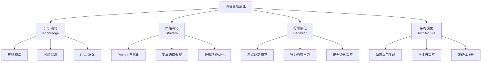

**图 4-1**：自演化智能体分类框架图

#### 4.1.1 经验驱动的终身学习

Xu et al. [38] 提出了经验驱动终身学习（Experience-Driven Lifelong Learning, ELL）的基准测试框架 **StuLife**（投稿 ICLR 2026），通过模拟学生从入学到毕业的完整大学经历来评估自演化智能体的核心能力。StuLife 围绕四个范式转变设计：**从模拟到现实**（任务忠实反映真实生活轨迹）、**从模仿到学习**（智能体需自主抽象可迁移技能而非简单复现）、**从上下文到记忆**（任务间存在时间和逻辑关联，要求长期记忆保持和检索）、**从被动到主动**（智能体需展现时间意识、目标设定和内在动机）。基准包含 1284 个任务、10 个互联场景、3 个核心模块（课内、日常校园、考试），并提出了统一评估指标 **StuGPA**。实验结果显示：即使高能力模型在该基准上也仅获得 **17.9/100** 的 StuGPA 分数，揭示了当前 AI 在长期记忆保持和自主动机行为方面与人类自主学习能力之间的显著差距——这为自演化智能体研究设立了明确的能力天花板。

#### 4.1.2 自主重训练

Wang et al. [39] 的"Self-Evolving Agents: A Cookbook for Autonomous Agent Retraining"（OpenAI Cookbook, 2025）提供了自演化智能体构建的工程实践指南，以医疗法规文档起草为案例展示了完整的自愈循环。该 Cookbook 定义了一个**四步迭代改进闭环**：

1. **Baseline Agent 执行**：基线智能体在目标任务上生成输出（如诊断报告、摘要文档）
2. **Human Feedback / LLM-as-Judge 评估**：输出由人类审核员或自动化的 LLM 评判系统评估，产生定量分数和定性反馈（如"摘要过长"或 0—1 数值评分）
3. **Evals 驱动的 Prompt 迭代**：基于反馈生成新的 prompt，通过评估测试套件（Evals）计算聚合分数。循环持续直到聚合分数超过目标阈值（如 `score > 0.8`）或达到最大重试次数（如 `max_retry = 10`）——若达到重试上限，系统通知工程师需要人工介入
4. **Updated Baseline 替换**：达标的新版本替换原有基线，成为下一轮迭代的起点

该 Cookbook 的关键工程洞察在于：自演化不是一次性的训练过程，而是与生产工作流紧密耦合的**持续反馈循环**——系统从"人工详细修正"逐步过渡到"人工高层监督"，在保持严格质量标准的同时提升自动化程度。这种思路与 AgenticSRE 中 ContextLearner 的 auto/supervised 双模式学习机制高度一致。

### 4.2 演化的四个维度

#### 4.2.1 知识演化：规则积累与经验提炼

知识演化是最直接的演化形式，通过积累结构化的诊断知识来增强智能体的分析能力。

**规则积累**：从成功的根因分析中自动提炼结构化诊断规则，存入知识库。例如：

```json
{
  "condition": "容器内存使用率 > 95% 且 OOMKilled 事件存在",
  "conclusion": "内存泄漏导致 OOMKill",
  "confidence": 0.92,
  "source": "auto_learned",
  "timestamp": "2026-03-15T10:30:00Z"
}
```

**经验提炼**：不仅记录"what happened"，还提炼"why it happened"和"how to diagnose"。WeRCA [59] 的记忆学习机制是这一方向的典范——它从每次根因分析中提取因果推理链，并将其结构化为可检索的记忆单元。

**RAG 增强**：利用检索增强生成（Retrieval-Augmented Generation, RAG）技术，在推理时动态检索最相关的历史知识。向量化存储（如 ChromaDB）使得语义相似度检索成为可能，即使故障的表面特征不同，只要根因相似就能被检索到。

#### 4.2.2 策略演化：推理路径与工具选择优化

策略演化关注的是"如何分析"而非"分析什么"——优化智能体的推理策略和工具使用模式。

- **Prompt 自优化**：根据历史表现自动调整系统提示词。例如，如果某类故障的诊断经常失败，系统会自动在 prompt 中增加相关的注意事项和分析策略。
- **工具选择策略调整**：学习在什么情况下优先调用什么工具。例如，经过多次实践后，系统学会对于网络相关故障应先查看 TCP 重传指标而非 CPU 使用率。
- **推理路径优化**：分析成功和失败的推理轨迹，识别高效的推理模式并固化为策略。

AgentFlow [82] 是策略演化方向的近年代表工作之一。它没有改变所有模块的参数，而是聚焦训练 Planner，使其在共享记忆状态下学习"下一步应该验证哪个子目标、调用哪个工具、携带哪些上下文"。这与运维 RCA 的调查规划高度一致：根因定位的核心成本往往不在单次 PromQL 或日志查询，而在是否选择了高判别力的下一步调查。若将 RCA 成功命中、证据充分性、修复验证结果和安全约束作为奖励，Flow-GRPO 式方法可以作为 AgenticSRE 后续策略演化的可行方向。

#### 4.2.3 行为演化：反馈驱动的行为修正

行为演化通过外部反馈（人类专家、环境奖励信号）来修正智能体的行为模式。

**专家反馈循环**：人类 SRE 专家对智能体的诊断结果提供正面或负面反馈，系统据此调整后续行为。这种人在环路（Human-in-the-Loop）的演化模式兼顾了自动化效率和人类监督的安全性。

**行为约束学习**：从历史错误中学习行为约束。例如，如果智能体曾因执行不安全的 kubectl 命令导致服务中断，系统会自动将该类命令加入黑名单。

#### 4.2.4 架构演化：动态角色与拓扑自适应

架构演化是较高层次的演化形式，涉及智能体系统自身结构的调整。

- **动态角色生成**：根据新型故障模式自动创建新的专用智能体角色。例如，当系统首次遇到 GPU 相关的故障时，动态生成一个 GPU 分析智能体。
- **拓扑自适应**：根据任务类型动态调整智能体间的协作拓扑。OPTIMA [15] 的工作已经在通信拓扑优化方面做出了初步探索。
- **智能体增删**：根据工作负载和效果评估，动态增加高效的智能体实例或淘汰低效的智能体。

从架构演化角度看，AFlow [77]、ADAS [78]、GPTSwarm [79]、MASS [80] 和 Archon [81] 分别提供了不同强度的自动化机制：AFlow 偏动态 workflow 生成，ADAS 偏完整系统代码生成，GPTSwarm 偏图拓扑强化学习，MASS 偏 prompt-topology 联合优化，Archon 偏预算感知的推理时配置搜索。它们共同表明，多智能体系统的"架构"不再只是人工设计文档，而可以被运行数据、评测指标和搜索算法持续优化。对生产运维系统而言，更合理的落地方式是"离线搜索 + 人工审核 + 灰度上线"，而不是允许智能体在线任意改写自身结构。

### 4.3 演化驱动机制

#### 4.3.1 自监督学习：执行轨迹自动提炼

自监督学习是最常见的演化驱动机制，无需人类标注即可从智能体自身的执行经验中学习。

**核心流程**：
1. 智能体完成一次根因分析，TraceStore 记录完整的执行轨迹
2. RCAJudge 对分析结果进行自动化质量评估（规则评分 + LLM 评分加权）
3. 如果质量评分超过阈值，ContextLearner 自动从推理链中提炼诊断规则
4. 新规则入库到 FaultContextStore，后续分析时自动召回

这种"执行→评估→学习→应用"的闭环无需人工干预，实现了真正的自主演化。

以一个具体的运维场景为例说明这一流程：当 AgenticSRE 诊断出"compose-post-service 的高延迟是由 MongoDB 连接池耗尽导致"（置信度 0.87，Judge 评分 0.73），ContextLearner 会从推理链中自动提炼出规则——"若 MongoDB 连接等待时间 >500ms 且活跃连接数接近 maxPoolSize，则应优先排查连接池配置和慢查询"。这条规则被存入 FaultContextStore，下次遇到类似的 MongoDB 延迟问题时，系统会在假设生成阶段自动检索到这条规则，直接将"连接池耗尽"作为高优先级假设，大幅缩短诊断时间。

#### 4.3.2 监督学习：专家反馈激活

当自监督学习的质量不足时，专家反馈提供了更高质量的学习信号：

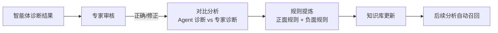

Wang et al. [23] 在 Self-Evolving Agents Cookbook 中详细描述了监督学习的最佳实践，包括如何设计高效的反馈收集界面、如何从对比分析中提炼最大化信息增益的规则。

#### 4.3.3 强化学习：奖励信号驱动策略更新

在多智能体协作场景中，强化学习（RL）可以用于优化智能体的通信策略和协作行为。OPTIMA [15] 的 DPO（Direct Preference Optimization）训练就属于这一范畴——通过对比"好的协作轨迹"和"差的协作轨迹"来优化智能体的行为策略。AgentFlow [82] 则将这一思路推进到在线执行流内部，通过 Flow-GRPO 在真实多轮 rollout 上训练 Planner。两者的区别在于：OPTIMA 更强调通信效率和轨迹偏好优化，AgentFlow 更强调在工具反馈和显式记忆共同作用下的长链路规划优化。

然而，RL 在 LLM 智能体中的应用面临两个核心挑战：
- **奖励设计困难**：根因分析的正确性难以自动量化
- **采样效率低**：实际运维场景中故障事件的频率有限

#### 4.3.4 进化算法：AlphaEvolve 等遗传式代码进化

Google DeepMind 的 AlphaEvolve [40]（2025 年 5 月）开创了一种**进化式编程智能体**范式——将 LLM 的创造性问题求解能力与自动化评估器和进化算法相结合。AlphaEvolve 的架构包含四个核心组件在分布式控制循环中协作：**Prompt Sampler**（从程序数据库中采样父程序和灵感源，组装提示词）→ **LLM Ensemble**（Gemini Flash 最大化探索广度，Gemini Pro 提供深度洞察，生成代码变体/diff）→ **Evaluators Pool**（自动化评估器对候选程序进行客观的准确性和质量评分）→ **Program Database**（实现进化选择，决定哪些程序进入下一轮的提示词）。

AlphaEvolve 的关键突破在于它不仅能进化单个函数（如其前身 FunSearch），还能进化**整个代码库**，发现更复杂的算法。已在 Google 的数据中心调度、芯片设计和 AI 训练流程中部署，发现了更快的矩阵乘法算法并解决了数学开放问题。在运维场景中，这种"LLM 作为变异算子 + 自动化评估作为适应度函数"的范式可直接应用于进化异常检测算法参数、优化告警规则阈值、以及发现新的日志模式匹配规则。

### 4.4 记忆系统与持续学习

#### 4.4.1 向量化故障指纹库

向量化存储是实现知识演化的技术基础。通过将故障特征（包括指标模式、日志模板、事件序列）编码为高维向量，可以实现：

- **语义相似度检索**：即使表面特征不同，但根因相似的故障可以被准确检索
- **聚类分析**：自动发现故障的类别和模式
- **趋势分析**：追踪特定类型故障的发生频率变化

常用的向量数据库包括 ChromaDB、Pinecone、Weaviate 等。在 AgenticSRE 系统中，我们采用 ChromaDB 作为向量化存储后端（详见第 6 章）。

#### 4.4.2 WeRCA 式记忆学习

WeRCA [59] 提出了一种**多模态故障上下文构建与迭代增强**的 RCA 框架，是记忆增强根因分析方向最具代表性的工作。WeRCA 的核心动机来自两个实际挑战：（1）在 WeChat 这样的大规模微服务系统中，单个故障案例可产生约 **2MB 的指标数据**，远超当前 LLM 的上下文窗口限制；（2）LLM 的预训练语料难以覆盖不断演进的业务故障模式，系统需要从历史案例中持续学习。

WeRCA 的架构由紧密耦合的**在线阶段**和**离线阶段**组成：

**在线阶段——多模态故障上下文构建**：由 Triage Agent 和一组可插拔的领域专家智能体（Log Agent、Change Agent 等）协同工作，通过**三层渐进式精炼**从海量可观测数据中构建结构化故障上下文：
- **图级上下文**（Graph-Level）：将微服务系统表示为调用图，识别异常传播的全局结构
- **节点级上下文**（Node-Level）：定位异常行为的具体服务实例
- **属性级上下文**（Attribute-Level）：深入到服务内部的具体指标/日志/变更事件，提供细粒度因果证据

这种由粗到精的渐进式分析策略有效抑制了噪声，使 LLM 能在有限上下文窗口内聚焦于高信号信噪比的关键信息。

**离线阶段——规则提炼与持续学习**：采用"条件→结论"（If condition → Then conclusion）格式从历史 RCA 案例中自动提炼可复用的诊断规则。Rule Agent 利用 LLM 对比智能体诊断结果与专家标注的真实根因，提取正面规则（"该策略有效"）和负面规则（"该判断有误"），存入 Rule Repository。后续在线分析时，相关规则被自动检索并注入 RCA Agent 的推理上下文。同时，Judge Agent 对低置信度的分析结果标记为需要人工审核，形成质量门控闭环。

WeRCA 的形式化表述清晰地刻画了这一在线-离线协同演化过程：

$$C_t = \mathcal{M}_{\text{ctx}}(O_t), \quad \mathcal{R}_t = \mathcal{M}_{\text{rca}}(C_t, \mathcal{L}_t), \quad \mathcal{L}_{t+1} = \mathcal{L}_t \oplus \Delta\mathcal{L}_t(C_t, \mathcal{R}_t)$$

其中 $\mathcal{M}_{\text{ctx}}$ 为上下文构建组件，$\mathcal{M}_{\text{rca}}$ 为根因分析组件，$\mathcal{L}_t$ 为第 $t$ 轮的规则集，$\oplus$ 运算符表示规则的增量更新。

在公开基准和 WeChat 生产系统（数百个微服务）的评估中，WeRCA 实现了 **71.43% 的 RCA 准确率**，**比现有方法提升超过 40 个百分点**，充分验证了"多模态故障上下文 + 持续规则学习"技术路线的有效性。

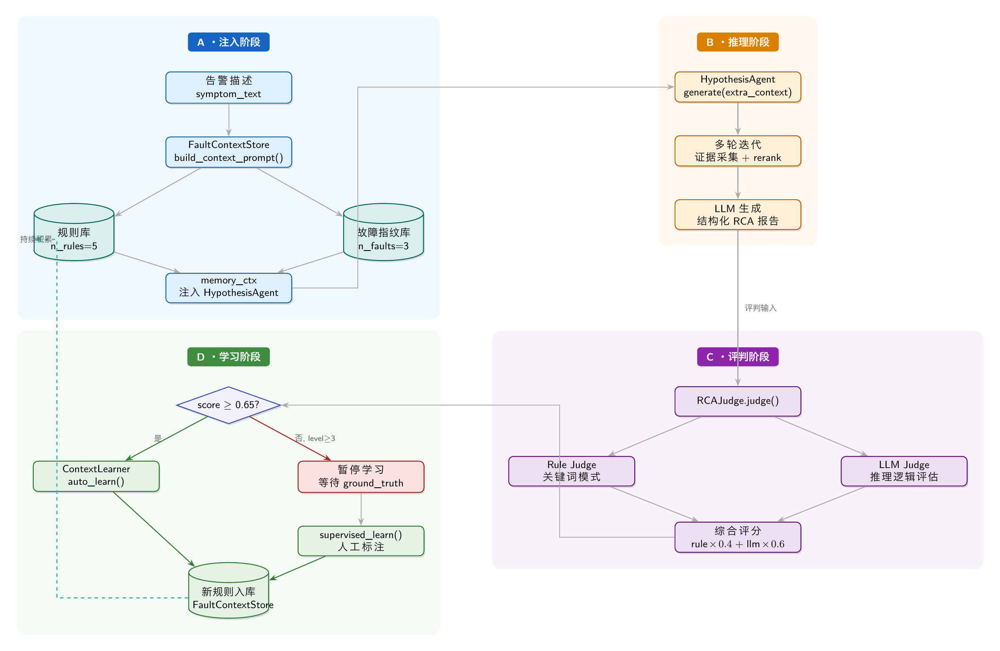

**图 4-3**：WeRCA 记忆学习流程图

#### 4.4.3 Dynamic Cheatsheet：测试时自适应记忆

Dynamic Cheatsheet [41]（Stanford & Together AI，arXiv 2025）提出了一种优雅的**测试时学习**框架，为黑盒 LLM 添加持久化、进化的外部记忆，无需微调或梯度更新。DC 包含两个核心模块在推理循环中交替工作：**Generator**（$\tilde{y}_i = \text{Gen}(x_i, M_i)$，参考当前记忆 $M_i$ 生成解答）和 **Curator**（$M_{i+1} = \text{Cur}(M_i, x_i, \tilde{y}_i)$，评估解答后更新记忆）。Curator 在更新时考虑三个标准：新解答的**有用性和可泛化性**（值得记住吗？）、现有条目的**精炼或移除**（旧知识过时了吗？）、以及整体记忆的**简洁性和紧凑性**（信息密度够高吗？）。

DC 的记忆内容与传统"追加完整对话历史"的方法有本质区别——它存储的是**自策划的简洁知识片段**（可复用的策略、经过验证的代码片段、通用的问题解决启发式规则），而非原始交互记录。这种选择性记忆机制防止了上下文膨胀，确保重复检索仍然高效。

实验结果显示：Claude 3.5 Sonnet 在 AIME 2024 数学竞赛上从基线 23% 跃升至 **50%** 准确率；GPT-4o 在 Game of 24 上从 10% 跃升至 **99%**（模型发现并记住了高效的 Python 暴力求解器，后续直接检索复用）。但 DC 存在一个重要限制：它能**放大强模型的优势但不能修补弱模型的基础缺陷**——GPT-4o-mini 等小模型因初始正确解过少，记忆中充斥着错误策略反而导致性能下降。这一发现对运维场景有直接启示：DC 式的测试时学习适合与高能力的 LLM 配合使用，而非作为弱模型的补丁。

#### 4.4.4 A-Mem 与 Memory-as-Action：从外部知识库到可学习上下文治理

A-Mem [45] 和 Memory-as-Action [48] 代表了记忆系统的两个新方向：前者关注长期记忆的组织结构，后者关注工作记忆的在线治理策略。

**A-Mem** [45] 受 Zettelkasten 卡片笔记法启发，将每条新经验写成结构化 note，而不是简单追加原始对话。note 包含时间戳、上下文描述、关键词、标签、动作内容和 embedding 等多种属性；写入时系统会检索历史记忆，识别语义相近或属性相关的 note，并自动建立链接。更关键的是，新记忆还可以触发旧记忆的**演化更新**：当新的故障案例揭示出更高阶的模式时，系统会改写历史 note 的上下文表述或标签，使记忆网络逐步形成可检索的知识图。相较于固定 schema 的图数据库，A-Mem 的优势是组织结构由 agent 动态生成，适合处理运维中不断出现的新服务、新指标和新故障模式。

在 AgenticSRE 中，A-Mem 的设计可以映射为"故障卡片 + 语义链接 + 演化标签"：每次 RCA 结束后生成一张故障 note，字段包括故障时间、受影响服务、关键指标、日志模板、变更事件、根因、修复动作、验证结果和风险标签。系统随后把这张 note 链接到相似根因、相似症状或相同变更类型的历史 note。这样做比单纯向量检索更适合运维知识库，因为 SRE 不仅需要找到相似案例，还需要看到故障族谱、传播路径和处理策略的演化。

**Memory-as-Action / MemAct** [48] 则将上下文管理从外部启发式模块提升为 agent 策略的一部分。传统方法通常由外部 controller 按规则触发 summarize、retrieve 或 discard，agent 本身不知道哪些信息被删减。MemAct 把记忆操作定义为可学习动作集合 $A_{\text{mem}}$，与任务动作 $A_{\text{task}}$ 处于同一策略空间：模型可以显式调用 Prune&Write 等动作，删除过期片段、保留关键证据或写入压缩摘要。为解决动态删除上下文带来的训练-推理不一致，论文提出 Dynamic Context Policy Optimization（DCPO），通过轨迹分段维持标准 RL 训练效率。

实验显示，MemAct-RL-14B 在长程 agent 任务中可达到比自身大 16 倍模型的准确率，同时平均上下文长度减少 51%，并能学到随模型能力和任务复杂度变化的记忆策略。对运维多智能体系统而言，这一结果非常重要：RCA 的失败常常不是因为缺少数据，而是因为上下文中混入太多低价值指标、重复日志和无关工具输出。短期可落地做法是先将 MemAct 思路参数无关化，即让 PlanningAgent 在每轮调查后输出"保留证据、丢弃证据、压缩摘要"三类结构化决策；长期可在可验证 RCA 轨迹充足后，用根因命中、证据充分性、Token 成本和安全违规作为奖励训练上下文治理策略。

### 4.5 演化质量评估与安全性

智能体演化过程中需要特别关注两个风险：

**知识退化（Knowledge Degradation）**：新学习的规则可能与旧规则矛盾，或者低质量的经验积累导致整体知识库质量下降。应对策略包括：
- 基于 RCA Judge 的质量门控，只有高于阈值的分析结果才能进入学习流程
- 定期的知识库审查和清理机制
- 版本化存储，支持知识回滚

**安全性问题**：自动化演化可能导致智能体学到不安全的行为模式（如误删关键资源）。应对策略包括：
- 操作安全白名单和黑名单机制
- 人在环路的审批流程（Human-in-the-Loop approval）
- 操作回滚栈（ActionStack）确保任何自动化操作可逆

### 4.6 本章小结

**表 4-1**：自演化技术路线对比

| 技术路线 | 学习信号 | 人工参与 | 演化速度 | 知识质量 | 代表性工作 |
|---------|---------|---------|---------|---------|-----------|
| **自监督学习** | 执行轨迹 + 自动评估 | 无 | 快 | 中 | AgenticSRE ContextLearner |
| **监督学习** | 专家反馈 | 高 | 慢 | 高 | WeRCA [59], 专家反馈机制 |
| **强化学习** | 奖励信号 | 低（设计奖励） | 中 | 中-高 | OPTIMA DPO [15], AgentFlow [82] |
| **进化算法** | 适应度函数 | 低（设计评估） | 中 | 视任务而定 | AlphaEvolve [40] |
| **工作流/拓扑搜索** | Benchmark 评价 | 中（审核上线） | 中 | 依评测而定 | AFlow [77], MASS [80], Archon [81] |
| **测试时学习** | 在线积累 | 无 | 即时 | 任务相关 | Dynamic Cheatsheet [41] |

综上所述，智能体演化技术为多智能体系统提供了持续改进的能力——从知识积累到策略优化，从行为修正到架构自适应。然而，这些技术大多在通用任务基准上得到验证，其在特定垂直领域（如运维）中的适用性和效果仍需进一步探索。下一章将聚焦于运维（AIOps）这一关键应用领域，考察多智能体协作与演化技术在实际运维场景中的应用现状、代表性系统和落地经验。

---

## 第 5 章 多智能体运维（AIOps）应用

前两章分别从协作机制和演化能力两个维度，构建了多智能体系统的技术理论框架。本章将视角从通用技术转向具体的应用领域——AIOps（智能运维），考察上述技术如何在真实的运维场景中落地。运维领域是多智能体协作的天然试验场：故障诊断需要多维度信号的协同分析（对应多智能体协作），运维知识需要持续积累更新（对应智能体演化），且运维工作本身就遵循团队分工协作的模式。

### 5.1 AIOps 的演进

AIOps（Artificial Intelligence for IT Operations）经历了四个技术代际的演进。相关的综合调研工作也日益丰富：Zhang et al. [55]（北京大学，arXiv 2024）首次系统性地覆盖了 LLM 在故障管理全流程中的应用，明确指出了传统 AIOps 与 LLM-based AIOps 的核心差异：传统方法缺乏**跨平台通用性**（模型针对特定软件系统调优训练）和**跨任务灵活性**（每个模型只能执行单一任务），而 LLM 的语言理解和推理能力可以显著缓解这两个瓶颈。该调研将 LLM 时代的 AIOps 故障管理划分为三个阶段：**故障感知**（Failure Perception，含告警管理和异常检测）→ **根因分析**（Root Cause Analysis）→ **自动修复**（Auto Remediation），并系统梳理了各阶段中 LLM 的具体应用方式（如 prompt 工程、RAG、ReAct 工具调用、微调等）。Chen et al. [56]（东南大学，arXiv 2024）专门针对微服务场景的根因分析进行了结构化综述，将 RCA 方法按数据源分为四类：基于指标、基于追踪、基于日志、以及**多模态融合**。该调研在 LLM-based RCA 方面梳理了清晰的演进脉络：早期方法如 Ahmed et al. 通过微调 LLM 从事故标题和摘要直接预测根因；RCACopilot 在此基础上增加了 RAG 和诊断数据收集工具，但依赖手工预定义的处理器（handlers）；近年的方法如 Wang et al.、Chen et al.、Roy et al.（2024）则采用 ReAct 智能体范式实现动态数据收集，克服了静态工作流的局限。在多模态融合方面，MULAN 利用对比学习提取模态不变和模态特有表示，通过 KPI 感知注意力机制评估模态可靠性并协同学习因果图；Pdiagnose 则通过对异常时序投票来确定根因。该调研指出，知识图谱辅助的 RCA（通过 PC 算法构建有向无环图 + BFS 搜索）是整合多数据源知识的另一个有前景方向。Gu et al. [57]（ACM TOSEM 2025）则在手动收集的 73 篇论文基础上，对过去十年微服务系统故障诊断的方法进行了全面分析，涵盖 ASE、ICSE、FSE、AAAI、KDD 等顶会。

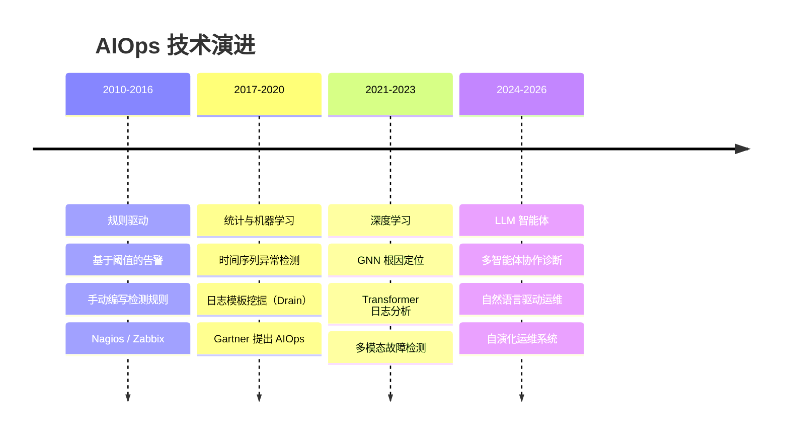

**图 5-1**：AIOps 技术演进时间线

Zhang et al. [54]（ACM Computing Surveys 2025，北京大学 & UIC）发表了该领域迄今最全面的综述，分析了 **183 篇**发表于 2020—2024 年间的论文，围绕四个研究问题展开：RQ1 数据来源（LLM 不仅能处理传统的指标/日志/追踪，还能利用软件文档、源代码、事故报告等**人类生成数据**作为新数据源）；RQ2 任务演进（LLM 时代催生了多个新子任务）；RQ3 LLM 方法分类（五类：基础模型、微调、嵌入、Prompt 工程、知识增强）；RQ4 评估方法论。

该调研的一个重要贡献是对**辅助修复**任务的自动化等级划分——从低到高依次为：（1）辅助提问（Assisted Questioning）、（2）命令推荐（Command Recommendation）、（3）脚本生成（Script Generation）、（4）缓解方案生成（Mitigation Solution Generation，唯一在 LLM 之前就存在的任务）、（5）自动执行（Automatic Execution）。这五个等级清晰地描绘了从"人主导+AI 辅助"到"AI 主导+人监督"的演进路径，其中后四项均为 LLM 时代新增的能力。

Zhang et al. [54]（ACM 2025）在"A Survey of AIOps in the Era of Large Language Models"中系统性地分析了 LLM 时代 AIOps 的三个核心环节：**故障感知（Failure Perception）**→ **根因分析（Root Cause Analysis）**→ **辅助修复（Assisted Remediation）**。这三个环节恰好对应了多智能体系统中不同智能体的职责分工。

### 5.2 运维领域的多智能体架构

#### 5.2.1 OpsLLM：LLM 驱动的运维智能体

OpsLLM [60] 提出了面向软件运维的**领域特化 LLM 构建方法论**，聚焦知识问答（QA）和根因分析（RCA）两大核心任务。该工作揭示了现有 LLM 在运维场景中的三个关键挑战：（1）**跨模态知识对齐困难**——运维知识分散在网页、软件文档、社区等异构来源中；（2）**多步 RCA 推理不一致**——实验显示现有 LLM 的 RCA 准确率低于 42%，且即使输出正确结果，推理过程的错误率也高达 65%—76%（即"通过错误推理得到正确答案"的 reward hacking 现象）；（3）**评估模糊性**——基于 ROUGE-L/BERTScore 的相似度评估不可靠。

OpsLLM 提出了三阶段解决方案：数据构建阶段从四类来源构建 15K 微调数据集，引入 **HITL（Human-in-the-Loop）知识标定**实现质量控制；后训练阶段先 SFT 注入领域知识，再通过基于 GRPO 的 **DPRM（Domain Process Reward Model）**进行过程级强化学习，采用两阶段课程学习确保推理正确性；评估阶段设计多专家自动基准生成。实验表明 OpsLLM-7B/14B/32B 在 QA 上提升 0.2%—5.7%，RCA 上提升 **2.7%—70.3%**，且可观测数据的表征融合压缩率达 >99%。

#### 5.2.2 OpsLens：多维可观测分析

OpsLens [61]（2026 年 2 月）提出了一种基于**多智能体协作与工具管理**的多模态 RCA 方案。OpsLens 的核心设计理念是摆脱对人工生成数据（历史事故报告、预建诊断工具）的依赖，直接对系统生成的多模态可观测数据（traces、logs、metrics）进行协作分析。每种数据模态由专用的 Explorer Agent 处理，智能体间共享中间分析结果以实现跨模态协作推理。

OpsLens 的关键创新在于**质量导向的工具管理机制**——LLM 不直接与原始可观测数据交互，而是通过生成和管理高质量的诊断工具（可执行代码）来处理数据。工具管理包含五个组件：（1）两阶段工具生成（任务分析→代码编写）；（2）基于反馈的工具精炼；（3）工具图（tool graph）记录工具间的拓扑上下文；（4）基于频谱的工具评分板（tool scoreboard）追踪历史表现；（5）工具信息库存储元数据。在公开基准 OpenRCA 的 335 个真实故障上，OpsLens 达到 **0.80 的 score rate**，超越基线 **2.04—4.75 倍**，并已部署在某云厂商的多个生产场景中。

#### 5.2.3 MetaKube：K8s 元诊断

MetaKube [62] 提出了一种**经验感知**（experience-aware）的 K8s 故障诊断框架，其设计灵感来源于认知心理学的**双过程理论**（dual-process theory）——人类专家在诊断中会根据问题复杂度在"快速直觉"和"深度分析"之间自适应切换。MetaKube 整合了三个协同组件：

1. **EPMN（Episodic Pattern Memory Network）**：情景化模式记忆网络，从历史诊断结果中持续抽象和精炼诊断模式。记忆检索同时考虑语义相似度 $\text{sim}(m_i, Q)$（余弦距离）和时间衰减 $\text{rec}(m_i) = \exp(-\Delta t_i / \tau_r)$，通过参数 $\lambda$ 在语义相关性和时间近因性之间动态平衡。

2. **KubeGraph**：动态因果知识图谱 $G_K = (V, E, \mathcal{R})$，EPMN 检索的记忆作为导航指引进行记忆偏置的知识图搜索，提取因果链 $\mathcal{G}^* = \{c_1, ..., c_n\}$，每条链代表一个经过验证的因果关系。

3. **KubeLLM**：基于 Qwen3-8B 的领域特化模型，在 12,000 样本的 KubeFault 数据集上通过领域微调和强化学习后训练。

**元认知控制器**基于聚合置信度 $C(\mathcal{M}^*)$ 动态路由查询：当 $C(\mathcal{M}^*) > \tau$ 时走**直觉通路**（EPMN→KubeLLM 快速模式匹配），否则走**分析通路**（EPMN→KubeGraph→KubeLLM 深度因果推理），实现了诊断速度和深度之间的平衡。在 1,873 个真实 K8s 故障场景的评估中，MetaKube 将 Qwen3-8B 的诊断分数从 50.9 提升到 **90.5 分**（接近 GPT-4.1 水平），其中 EPMN 通过经验学习贡献了 **15.3%** 的持续改进增益，充分验证了"从运维经验中学习"的技术路线。

#### 5.2.4 STRATUS：云原生故障定位

STRATUS [63]（UIUC & 清华 & IBM，NeurIPS 2025）提出了面向**自主 SRE**（Autonomous Site Reliability Engineering）的多智能体系统。与其他专注于辅助人类工程师的工具不同，STRATUS 的目标是完全自主地管理生产系统故障——从检测、定位、诊断到缓解，无需人工干预。系统包含四个专用智能体：Detection Agent ($\alpha_D$)、Diagnosis Agent ($\alpha_G$，同时负责定位和 RCA）、Mitigation Agent ($\alpha_M$)、以及**Undo Agent ($\alpha_U$)**。

STRATUS 的核心创新是形式化的安全规范 **TNR（Transactional No-Regression）**——确保：（1）缓解操作如果失败，可以"撤销"回到之前的状态；（2）系统在任何时刻都只能变好不能变差（no regression）。TNR 通过三种机制实现：状态机调度（写操作排他性，防止并发冲突）、沙箱隔离（限制操作范围）、以及**栈式回滚**（Undo Agent 追踪所有 write 操作并按正确顺序回滚）。Action Space 分为三层：$A_{\text{read}}$（只读，如 `kubectl get`）、$A_{\text{write}}$（可变更，如 `kubectl apply`）、$A_{\text{undo}}$（回滚）。Detection 和 Diagnosis 智能体只能执行 $A_{\text{read}}$，Mitigation 可执行 $A_{\text{write}}$ 和 $A_{\text{read}}$。

在 AIOpsLab 和 ITBench 两个 SRE 基准上，STRATUS 的故障缓解成功率超过强基线**至少 1.5 倍**（跨 GPT-4o、GPT-4o-mini、Llama3 多种模型）。TNR 的 undo-and-retry 机制被证明是性能提升的关键——它允许系统安全地探索新的缓解路径，同时避免进入不可恢复的错误状态。这一安全设计理念与 AgenticSRE 的 ActionStack 回滚机制高度一致。

#### 5.2.5 EvoAgentOps：运维智能体演化

EvoAgentOps [64] 提出了一种基于原则学习的**双向自演化**（Bidirectional Self-Evolution）评估与优化框架，直接解决了当前智能体演化中"行为优化了但评判标准不变"的关键瓶颈。EvoAgentOps 的核心洞察在于：现有的自演化方法（如 FLEX、ReasoningBank 等）只优化智能体行为而保持评判者（Judge）的标准固定，导致评估反馈环断裂——随着智能体不断改进，固定的评判标准逐渐滞后，无法有效引导进一步的优化。

EvoAgentOps 的核心机制包括三个层面：

1. **证据驱动的层次化评估**：设计了一套 4 层 26 类型的故障分类体系（Taxonomy），使用二元检查标准（binary check criteria）实现**步骤级**（step-level）故障定位——不仅判断"任务是否失败"，还精确定位"哪一步出了问题、为什么出错"。这与传统 LLM-as-a-Judge 只输出全局分数形成鲜明对比。实验表明，步骤级故障定位准确率从基线方法的 **35% 以下提升至 65%—90%**。

2. **原则库（Principle Bank）的双向学习**：从评估结果中同时提取两类可复用原则——**执行原则**（Execution Principles，格式为"When [trigger], [action] by [method], avoiding [pitfall]"，用于改进智能体行为）和**评判原则**（Judge Principles，格式为"When evaluating [metric], check [criteria] and mark as [verdict]"，用于改进评估标准）。原则库支持三种管理操作：Add（插入新原则）、Modify（吸收更新）、Merge（合并相似原则），实现知识的有效压缩（压缩率超过 **60%**）。

3. **自动化评判验证**：通过向成功轨迹中注入已知故障来创建标注测试数据，使得评判器的故障定位准确率可以在无需人工标注的情况下进行定量验证。

### 5.3 运维关键任务的多智能体方案

#### 5.3.1 异常检测与告警压缩

**异常检测**是运维的第一道防线。常用的异常检测算法包括：

| 算法 | 原理 | 适用场景 | 局限性 |
|------|------|---------|--------|
| **Z-score** | 基于标准差的统计检测 | 平稳时间序列 | 对非平稳序列敏感 |
| **静态阈值** | 预设警告/严重阈值 | 已知正常范围的指标 | 无法适应动态基线 |
| **EWMA** | 指数加权移动平均 | 缓慢漂移的指标 | 对突变不敏感 |
| **IQR** | 四分位距异常检测 | 非正态分布数据 | 需要足够的数据量 |
| **3σ + Pearson onset** | Hero 风格的多信号关联 | 多维度关联异常 | 计算复杂度较高 |

**告警压缩**是应对告警风暴的关键技术。AlertInsight [66]（东北大学 & 东软，CSSE 2023）提出了基于**多重关联挖掘**（multiple correlation mining）的告警聚合框架。传统方法基于成对关联（pairwise correlation），将多重关联视为成对关联的线性组合，但在复杂系统中这一假设不成立——例如三个事件 $\{E_3, E_4, E_5\}$ 可能存在多重关联（$E_3$ 和 $E_4$ 的重叠故障导致 $E_5$ 崩溃），而任意两个事件之间并无显著的成对关联。AlertInsight 采用三步流程：（1）从历史事件序列中以**全景视角**（panoramic view）直接挖掘多重关联模式，避免组合爆炸；（2）利用挖掘到的关联知识训练神经网络在线检测器；（3）将关联事件聚合为单个高级事件实现告警压缩。实验结果显示 precision=0.92、recall=0.93、F1=0.93。在 AgenticSRE 的实验中，类似的语义化告警聚合机制实现了 **57.1%** 的告警压缩率。

#### 5.3.2 根因分析：Hero 多信号关联 + 图推理

**Hero** [58] 提出了一种**假设增强推理与编排**（Hypothesis-Enhanced Reasoning and Orchestration）框架，是根因分析领域从线性 ReAct 范式向假设驱动范式转变的标志性工作。Hero 的核心洞察来自对生产环境的实证研究：传统 ReAct 智能体存在三个关键缺陷——**隧道视觉**（Tunnel Vision，沿单一路径深入而忽略其他信号）、**静态 SOP 依赖**（60% 的 SOP 因系统演进而过时）、以及**非结构化探索的低效**（缺乏假设剪枝，浪费 Token 和时间）。

Hero 的方法论建立在 Dempster-Shafer 证据理论之上，将 RCA 建模为**顺序信念精炼过程**（Sequential Belief Refinement Process）。其关键技术组件包括：

1. **假设空间建模**：定义辨识框架 $\Theta = \{h_1, \ldots, h_N\}$，每个 $h_i$ 代表一个候选根因（如 CPU 饱和、数据库连接耗尽等）。系统维护一个基本信念赋值（BBA）$m_t: 2^\Theta \to [0,1]$，不仅表达对单个假设的支持度，还通过复合集合 $|A|>1$ 显式建模**认知不确定性**——$m_t(\Theta)$ 直接量化了系统在第 $t$ 轮缺乏全局判别信息的程度。

2. **冲突感知的判别性行动生成**：区别于传统 RAG 方法执行预定义 SOP，Hero 的任务规划器采取"基于冲突验证差异"的策略——将当前 top-K 竞争假设注入 prompt，显式标注假设间的冲突点（如"假设 A 预测网络丢包而假设 B 预测应用超时"），引导 LLM 生成**反事实推理**式的验证行动，产出具有高判别力的证据。

3. **神经-符号融合的信念更新**：提出 LLM 驱动的神经-符号映射函数 $\mathcal{Z}: \mathcal{O} \times \mathcal{A} \times 2^\Theta \times \mathcal{K} \to \mathcal{B}$，将非结构化观测（日志文本、指标序列）转换为 Dempster-Shafer 理论所需的结构化三元组 $(\hat{H}, p, c)$——包含目标假设集 $\hat{H}$、极性 $p \in \{+1, -1, 0\}$（支持/反驳/无关）、和置信度 $c$。再通过**广义 PCR6**（Proportional Conflict Redistribution Rule 6）进行多源证据融合，该算子按冲突量成比例重分配质量，避免了简单 Bayesian 更新在微服务场景中的脆弱性（需要手动设置先验）。

4. **自适应注意力与启发式决策**：基于 pignistic probability BetP 的自适应策略——当某假设的 BetP 低于剪枝阈值时标记为 Disproven 并移除（避免浪费资源）；下一轮规划器仅关注 BetP 排名靠前的假设（模拟专家"聚焦主要嫌疑"的行为）。

Hero 在某顶级云厂商的生产环境中部署验证，在真实故障事件上实现了相比同期 ReAct 方法 **27% 的 RCA 准确率提升**，同时显著减少了无效的探索步骤。

**图推理 RCA** 在 Hero 的基础上引入服务拓扑图的结构信息：

- 构建服务依赖图（Service Dependency Graph），其中节点为微服务，边为调用关系，边权重由调用频率和延迟相关性共同决定
- 将异常检测结果注入图节点作为先验概率——异常评分越高的服务，初始"嫌疑值"越大
- 运行 PageRank 变种算法，核心思想是"异常会沿调用链反向传播"：如果一个下游服务异常，那么调用它的上游服务也可能受到影响，但真正的根因往往是传播链的起点
- 经过多轮迭代收敛后，最终排名靠前的节点即为推荐的根因服务

以 DeathStarBench Social Network 为例：当 compose-post-service 出现延迟尖峰时，graph RCA 发现 MongoDB 和 Redis 的异常评分也偏高。通过分析调用关系图，算法追溯到 compose-post-service → MongoDB 这条边的延迟贡献最大，最终将根因定位到 MongoDB 而非表面上最先报告异常的 compose-post-service。

Flow-of-Action [67]（WWW Companion 2025）进一步将标准操作程序（SOP）融入 LLM 多智能体 RCA 系统中。该工作首先指出 ReAct 虽然符合 SRE "思考-行动-观察"的排障习惯，但在 RCA 中容易因幻觉或上下文过载选择无关工具，后续步骤会沿错误路径累积偏差。Flow-of-Action 的核心改造有三点：

1. **SOP flow**：将专家 SOP 纳入知识库，并提供 SOP 匹配、SOP 自动生成、SOP 转代码等工具，使主智能体在正常情况下沿标准诊断步骤行动，而不是完全自由探索。

2. **Thought-ActionSet-Action-Observation 范式**：不再让 LLM 直接输出单个 action，而是先生成一个有理由的候选 action set，再由主智能体选择最终动作，从而降低一次性动作选择错误的风险。

3. **多辅助智能体分工**：MainAgent 负责整体编排，ActionAgent 提供可行动作集合，ObAgent 从大量观测中抽取故障类型和关键信息，JudgeAgent 判断根因是否已找到，CodeAgent 负责 SOP 到代码的转换。这个分工减轻了 MainAgent 同时做规划、解析、判断和代码生成的负担。

在 Kubernetes RCA 基准上，Flow-of-Action 使用 GPT-4-Turbo 时平均准确率达到 **64.01%**，显著高于 ReAct 的 **35.50%**；基于 GPT-3.5-Turbo 时也达到 **54.06%**。K8SGPT 和 HolmesGPT 因只能覆盖单一故障类型，准确率固定在 11.11%。对 AgenticSRE 的启示是：SOP 不应只是文档检索材料，而应转化为可执行、可审计、可跳转的流程约束；同时应把"是否已足够定位根因"交给独立 JudgeAgent，而不是让执行智能体自行终止。

Chain-of-Event（CoE）[72]（FSE Companion 2024）提供了另一条与 LLM agent 互补的白盒 RCA 路线。CoE 先把指标、日志、调用链和运维活动统一转换为事件，事件包含 WHAT、WHEN、WHERE 三类信息；再从历史事故自动学习一个加权事件因果图，图中边权表示一个事件由另一个事件触发的可能性，节点权重表示事件在系统中的重要性。推理时，CoE 根据当前事故的事件集合构建 incident-specific event-causal graph，并通过事件链贡献计算每个事件作为根因的分数。

CoE 的价值在于兼顾自动学习和 SRE 可解释性：与深度模型相比，它的参数有明确物理含义；与 Groot 等手工事件图方法相比，它不依赖人工维护因果边。论文在超过 5,000 个服务的电商系统数据上评估，在 Service 数据集取得 **79.3% top-1 / 98.8% top-3**，在 Business 数据集取得 **85.3% top-1 / 96.6% top-3**。相比手工配置事件图的 Groot，CoE 在 Service 数据集提升 5.3% top-1 和 6.8% top-3，在 Business 数据集提升 4.3% top-1。对本项目而言，CoE 适合作为 RCA Agent 的结构化先验：LLM 负责解释、检索和行动规划，CoE 负责给出事件级候选根因和传播链，二者结合能避免纯 LLM 排障的不可控探索。

SparseRCA [73]（ISSRE 2024）则专门面向测试环境中的稀疏 trace RCA。测试环境与生产环境不同：调用链样本少、分布不均、服务频繁升级，传统依赖密集 trace 聚合指标或稳定拓扑的 RCA 方法很容易失效。SparseRCA 不使用人工标注，而是以 span 为原子单元，估计每个服务调用的**独占延迟**（exclusive latency）异常程度，并用 decoupled atomic span units 重构新 trace 的延迟表现，解决频繁升级导致的未见调用结构问题。随后，它通过 Pattern-Based Modeling（PBM）整合同类调用模式，通过 Distribution-Based Anomaly（DBA）处理延迟分布波动，再用 personalized PageRank 式 Root Cause Modification（RCM）结合拓扑修正候选排序。

在某大型电商测试环境约 6,000 条 trace、507 个微服务、120 条专家标注异常 trace 上，SparseRCA 达到 **66.1% A@1、86.4% A@3、88.1% A@5**，高于 MicroRank、MicroScope、AutoMap、MicroHECL 等无监督基线；训练全量数据约 12 分钟，单 trace 推理约 0.2 秒。消融实验显示，RCM 对 top-1/top-3 排名提升最明显，PBM 和 DBA 则主要缓解稀疏样本和执行时间波动。对 AgenticSRE 原型而言，SparseRCA 的直接价值在灰度发布、集成测试和故障演练阶段：当生产级指标还未形成稳定基线时，可用 trace span 级独占延迟异常先给出候选服务，再由 LLM Agent 汇总日志、变更和配置证据。

RC-LLM [68]（arXiv 2026）则提出了残差连接式的根因分析方法，将多源遥测数据与 LLM 推理结合，在 CCF-AIOps 微服务数据集上取得了优异的准确率。

值得特别关注的是 **PRAXIS** [65]（UIUC & IBM Research，arXiv 2025），它将 RCA 从微服务层扩展到了**代码层**——利用双图联合推理，在 SDG（Service Dependency Graph，捕获微服务间调用依赖）和 PDG（Program Dependence Graph，基于 hammock block 捕获每个微服务内部的代码级控制/数据/调用依赖）之间进行 **Cross-SDG-PDG 遍历**。当故障链跨越多个微服务时，LLM 可以从一个微服务的 PDG（代码级）回溯到 SDG（微服务级），再进入另一个微服务的 PDG 继续追踪，直到定位到具体的故障代码行或配置项。这种结构感知的图遍历策略在 30 个真实云事故上实现了 **61.5% 的根因推理准确率**（3.1x 提升）和 **73.9% 的根因识别准确率**（2.1x 提升），同时将 Token 消耗从 624.4k 压缩至 166.5k（**3.8x 压缩**）。PRAXIS 的关键启示在于：超越可观测性症状、深入到代码级的根因定位是 LLM 运维智能体的重要演进方向。

#### 5.3.3 故障自愈与修复验证

故障自愈（Auto-Remediation）是 AIOps 的高阶形态。多智能体系统在自愈场景中的典型架构为：

1. **诊断智能体**确定根因和修复方案
2. **规划智能体**生成修复操作序列（如 kubectl scale, kubectl rollout restart）
3. **执行智能体**在沙箱或 dry-run 模式下预执行，验证安全性
4. **验证智能体**在执行后检查系统状态是否恢复正常
5. **回滚智能体**如果修复失败，自动执行回滚操作

**操作回滚栈（ActionStack）**是自愈安全的核心保障——每个自动执行的操作都被记录在栈中，支持按序回滚。

#### 5.3.4 链路追踪与性能分析

**LatenseeR** [69]（Emory & CMU & Princeton，SoCC 2023）提出了一种基于因果建模的端到端延迟分布估算框架。不同于传统黑盒方法仅能得出关联性结论，LatenseeR 将微服务的延迟估算建模为因果模型——一个复杂服务的延迟分解为其组成微服务之间的因果交互。核心数据结构是 **Latency-endowed Dependency Tree（L-tree）**和 **set nodes**（聚类相似执行路径的 trace）。LatenseeR 的关键能力是支持**假设场景分析**（what-if analysis）：运维人员可以提出"如果某个微服务的延迟增加 X ms，端到端延迟会如何变化？"这类问题，辅助服务部署和松弛度分析（slack analysis）决策。该框架不要求定制插桩，直接利用 Jaeger/OpenTelemetry 等现有分布式追踪系统的数据。在 DeathStarBench Social Network 的受控实验和 Alibaba/Twitter 的生产追踪数据上，LatenseeR 的预测误差仅为 **5.35%**（D-statistic），而强基线方法的误差超过 9.5%。

**VAIF** [70]（BU & Tufts，SoCC 2021）提出了**方差驱动的自动化插桩框架**，核心洞察是：请求响应时间方差可分解到工作流关键路径的各片段上，高方差区域即性能问题源。VAIF 结合分布式追踪和控制逻辑，自动搜索需启用的追踪点，在 OpenStack/HDFS/DeathStarBench 实验中仅需启用 **3—34%** 的追踪点即可定位问题。

**FaultProfIT** [71]（CUHK & 华为云，ICSE-SEIP 2024）聚焦于大规模云系统事故工单的**层次化故障模式分析**。CloudA 积累了 334 个故障模式，组织为 5 层树状分类体系。FaultProfIT 利用**层次引导对比学习**训练层次感知分类器，结合 Graphormer 编码故障层次结构。已在 CloudA 部署 6 个月，分析 30+ 云服务的 **10,000+** 事故工单，成功揭示故障趋势并指导系统改进。

### 5.4 运维场景下的智能体演化需求

运维场景对智能体演化有特殊需求：

1. **知识时效性**：基础设施和应用栈持续更新，旧的诊断知识可能失效
2. **故障分布漂移**：随着系统演进，新型故障模式不断出现
3. **跨集群泛化**：在一个集群上学到的经验需要迁移到配置不同的新集群
4. **安全性约束**：自动化操作必须在安全边界内进行，演化过程不能引入危险行为

### 5.5 本章小结

**表 5-1**：运维 LLM Agent 系统对比

| 系统 | 年份 | 信号维度 | 核心技术 | 演化能力 | 开源 |
|------|------|---------|---------|---------|------|
| OpsLLM [60] | 2024 | 多维度 | SFT+RL(DPRM) 领域特化 | 无 | 未公开 |
| OpsLens [61] | 2024 | 指标+日志+链路 | 多维可观测融合 | 无 | 否 |
| MetaKube [62] | 2024 | K8s 原生信号 | 元学习适配 | 跨集群迁移 | 否 |
| STRATUS [63] | 2023 | 指标+链路 | GNN 图推理 | 无 | 否 |
| EvoAgentOps [64] | 2024 | 多维度 | 演化框架 | 完整演化链路 | 否 |
| Hero [58] | 2023 | 指标+日志+事件+链路 | 3σ+Pearson 关联 | 无 | 否 |
| WeRCA [59] | 2024 | 多维度 | 记忆增强 RCA | 记忆学习 | 否 |
| Flow-of-Action [67] | 2025 | 多维度 | SOP 增强 MAS | 无 | 否 |
| **AgenticSRE** | 2026 | 指标+日志+事件+链路 | 假设驱动 + 6 范式 | 完整演化链路 | 研究 |

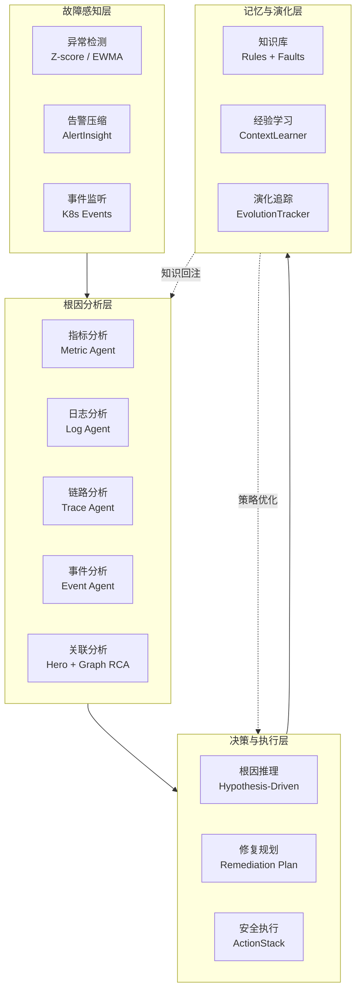

**图 5-2**：运维多智能体系统通用架构图

以上综述了多智能体运维技术的学术研究现状。然而，从论文到系统、从算法到产品之间往往存在明显差距——学术论文中优雅的架构图在面对真实集群的复杂性时是否依然有效？理论上的演化机制在实际运行中能否真正带来性能提升？下一章将通过本项目开发的 AgenticSRE 系统，以详尽的系统设计、代码实现和实验数据来回答这些问题，展示多智能体协作与演化技术从理论到实践的落地路径。

---

## 第 6 章 AgenticSRE 系统实践

本章以本项目开发的 AgenticSRE 系统为核心案例，展示多智能体协作与演化技术在 Kubernetes 集群根因分析中的落地实践。AgenticSRE 是一个面向通算与智算场景的多智能体协作运维系统，实现了从异常检测、根因分析到自动修复的全链路智能化。

### 6.1 系统概述与设计目标

#### 6.1.1 设计目标

AgenticSRE 的设计目标直接来源于华为 2012 实验室 SOW 对"运维多智能体协作技术研究"的验收要求。与通用 Agent Demo 不同，该系统的目标不是证明 LLM 可以调用工具，而是验证多智能体架构能否在真实 Kubernetes 运维链路中稳定完成告警压缩、证据采集、根因定位、修复建议和经验沉淀。因此，系统设计从一开始就围绕三个可验收问题展开：是否能够构建覆盖告警、日志、指标、调用链、Profiling 和 K8s 操作的专用智能体团队；是否能够在同一故障场景下比较 Chain、ReAct、Reflection、Plan-and-Execute、Debate 和 Voting 等协作范式；是否能够把诊断结果、专家反馈和执行轨迹沉淀为可复用知识，并在后续 RCA 中形成可观测的准确率提升。

在指标层面，AgenticSRE 将 SOW 中的能力要求转化为工程可检查目标：告警压缩与根因推荐需要达到可量化效果，根因推荐准确率以 80% 作为阶段性验收基线；智能体行为需要具备端到端可观测性，覆盖输入、输出、中间推理、工具调用和性能指标；持续演化能力需要通过专家反馈、RCAJudge 质量门控和历史轨迹学习闭环实现，并以根因定位准确率提升 10% 作为后续迭代目标。这样的目标拆解使系统不只关注"能否生成一份诊断报告"，而是关注诊断过程是否可审计、可复现、可比较和可持续改进。

#### 6.1.2 技术选型

| 技术栈 | 选型 | 理由 |
|--------|------|------|
| **LLM 引擎** | DeepSeek-Chat (OpenAI 兼容 API) | 性价比高，中文能力强 |
| **Web 框架** | FastAPI + Jinja2 + SSE | 异步支持好，实时推送能力强 |
| **向量数据库** | ChromaDB | 轻量级，适合嵌入式部署 |
| **可视化** | Chart.js + Three.js | 丰富的图表 + 3D 数字孪生 |
| **集群管理** | kubectl + K8s Python SDK | 原生 K8s 操作能力 |
| **可观测性** | Prometheus + Jaeger | 业界标准的指标和链路追踪方案 |

### 6.2 系统架构

AgenticSRE 采用五层架构设计，自顶向下分别为 Web 展示层、编排层、范式层、智能体/工具层、记忆与演化层。

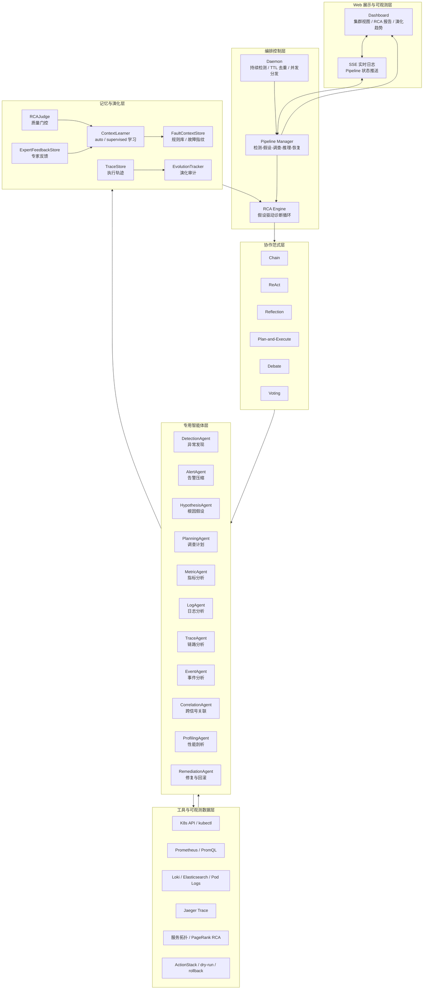

**图 6-1**：AgenticSRE 系统架构图

#### 6.2.1 编排层：Pipeline + Daemon + RCA Engine

编排层是 AgenticSRE 的核心控制平面，其职责不是直接完成某一类诊断，而是把持续监控、一次性 RCA、范式实验和演化学习组织成可运行的闭环。`orchestrator/daemon.py` 负责 7×24 异常发现，以可配置轮询间隔检测 Prometheus 告警、K8s 事件和日志异常，并通过 TTL 去重机制抑制重复触发；当异常满足触发条件后，Daemon 将事件分发给 `orchestrator/pipeline.py`，后者以五阶段 Pipeline 形式封装从检测到修复验证的完整流程，并通过 SSE 将运行状态推送到前端。

在每次 RCA 任务内部，`orchestrator/rca_engine.py` 承担假设驱动诊断循环的主体逻辑。该循环将专家 SRE 常用的"先形成候选根因，再围绕假设收集证据"编码为九个连续步骤：上下文检索、假设生成、调查规划、多智能体并行证据采集、假设重排序、跨信号关联、图推理 RCA、最终报告生成、质量评估与自学习。这样的编排方式有两个工程价值：一是把 LLM 的开放式推理约束在可审计的状态机中，降低自由探索带来的不确定性；二是把每个阶段的输入输出保存下来，为后续范式对比、性能归因和经验学习提供结构化轨迹。

#### 6.2.2 范式层：六种协作范式实现与对比

AgenticSRE 在 `paradigms/` 模块中实现了六种完整的多智能体协作范式，所有范式共享同一个 `AgentPool`（相同的 LLM 客户端、工具注册器和智能体实例），确保对比评估的公平性：

| 范式 | 实现文件 | 执行流程 |
|------|---------|---------|
| Chain | `paradigms/chain.py` | Event→Metric→Log→Trace→LLM 综合 |
| ReAct | `paradigms/react.py` | Thought→Action→Observation 循环（最多 8 步） |
| Reflection | `paradigms/reflection.py` | 并行采集→初始分析→自省→改进（最多 2 轮） |
| Plan-and-Execute | `paradigms/plan_and_execute.py` | 假设→规划→并行调查→重排序→关联 |
| Debate | `paradigms/debate.py` | 基础设施/应用/全局三视角→裁判综合 |
| Voting | `paradigms/voting.py` | 三温度采样(0.1/0.5/0.8)→多数投票 |

每个范式继承自 `ParadigmBase` 抽象基类，实现 `_execute()` 方法。基类的 `run()` 方法自动处理计时、错误捕获和演化快照记录。

#### 6.2.3 智能体层：11 个专用智能体角色设计

AgenticSRE 共设计了 11 个专用智能体，分为三类：

**检测类智能体**（4 个）：负责多维度信号采集

| 智能体 | 职责 | 数据源 | 关键能力 |
|--------|------|--------|---------|
| MetricAgent | 查询 Prometheus 指标，检测异常模式 | Prometheus API | PromQL 生成、时间序列分析 |
| LogAgent | 搜索日志，提取错误模式 | Elasticsearch / Pod Logs | Drain3 日志聚类 |
| TraceAgent | 分析分布式追踪，定位延迟瓶颈 | Jaeger API | P95/P99 分析、关键路径识别 |
| EventAgent | 检查 K8s 事件，识别 Warning 信号 | K8s Events API | 事件分类、时间关联 |

**推理类智能体**（5 个）：负责分析推理和决策

| 智能体 | 职责 | 关键能力 |
|--------|------|---------|
| AlertAgent | 告警压缩与语义聚合 | 告警分组、根因推荐、LLM 摘要 |
| HypothesisAgent | 生成根因假设，注入历史知识 | 假设排序、置信度评估、迭代重排 |
| CorrelationAgent | Hero 风格跨信号关联矩阵 | 3σ 检测、Pearson 相关、复合评分 |
| PlanningAgent | 生成针对性的调查计划 | 子任务分解、优先级排序 |
| ProfilingAgent | 性能 Profiling 分析 | CPU/内存/IO 热点定位 |

**执行类智能体**（2 个）：负责操作执行和验证

| 智能体 | 职责 | 安全机制 |
|--------|------|---------|
| DetectionAgent | 持续异常检测（Daemon 模式） | Z-score/EWMA/静态阈值可配置 |
| RemediationAgent | 自愈操作执行与回滚 | ActionStack 回滚栈、dry-run 模式、审批流程 |

**表 6-1**：AgenticSRE 11 个智能体角色与职责

#### 6.2.4 工具层：K8s / Prometheus / Jaeger / 异常检测

工具层采用统一的 `ToolRegistry` 机制，所有工具继承自 `BaseTool` 抽象基类并通过装饰器注册。这一设计把 LLM 智能体可调用的外部能力限制在受控工具集合内，避免智能体直接拼接任意命令或访问未授权数据源。当前工具能力覆盖 K8s 资源查询与操作、Prometheus instant/range query、Jaeger 服务发现与 Trace 详情查询、Z-score/静态阈值/EWMA 异常检测、Hero 风格跨信号关联、PageRank 变种图推理 RCA，以及用于修复操作回滚的 ActionStack。

从运维落地角度看，工具层承担了"事实约束"功能。LLM 负责提出假设、组织证据和生成解释，但关键观测必须来自 Prometheus、Jaeger、K8s API 或日志后端等可复现工具调用；修复操作必须经过 ActionStack、dry-run 和配置开关约束。这使 AgenticSRE 的诊断报告能够回溯到具体指标、事件和调用链，而不是停留在不可验证的自然语言推测。

#### 6.2.5 记忆与演化层

记忆与演化层是 AgenticSRE 实现持续改进的核心，包含以下组件：

| 组件 | 功能 | 演化贡献 |
|------|------|---------|
| **FaultContextStore** | ChromaDB 向量存储（规则库 + 故障指纹库） | 知识演化载体 |
| **ContextLearner** | WeRCA 式规则自动提炼（auto + supervised） | 知识积累引擎 |
| **RCAJudge** | 规则评分 + LLM 评分加权的质量评判 | 演化质量门控 |
| **TraceStore** | 智能体执行轨迹存储 | 策略优化数据源 |
| **ContextBuilder** | 统一上下文组装器 | 知识注入接口 |
| **DomainAdapter** | 领域配置加载与切换 | 跨域泛化支持 |
| **ExpertFeedbackStore** | 专家反馈存储 | 监督学习信号 |
| **EvolutionTracker** | 系统演化趋势追踪 | 演化可视化 |

### 6.3 五阶段假设驱动 Pipeline

AgenticSRE 的核心诊断流程采用五阶段假设驱动 Pipeline：

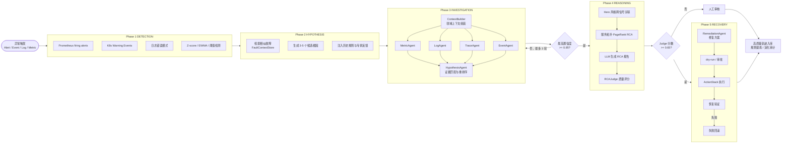

**图 6-2**：AgenticSRE 五阶段 Pipeline 流程图

**Phase 1 — DETECTION（检测）**负责把持续运行环境中的噪声信号转化为可诊断事件。系统持续轮询 Prometheus firing alerts，扫描 K8s Warning 事件，查询日志后端中的错误模式，并对关键指标运行 Z-score、EWMA 或静态阈值检测。该阶段不追求立即给出根因，而是尽可能稳定地识别"值得启动 RCA 的异常窗口"，并保留触发证据，供后续假设生成使用。

**Phase 2 — HYPOTHESIS（假设生成）**将检测信号转化为 3—5 个候选根因。与直接让 LLM 总结所有观测不同，AgenticSRE 会先从 FaultContextStore 检索历史相似故障和诊断规则，再由 HypothesisAgent 结合当前告警、事件、日志和历史知识生成候选假设。每个假设不仅包含自然语言描述，还包含故障类型、预期影响和调查方向。这一设计借鉴 WeRCA 式记忆增强思路，使系统在面对重复或相似故障时能够复用过去的诊断经验。

**Phase 3 — INVESTIGATION（多智能体并行调查）**是多智能体协作价值最集中的阶段。ContextBuilder 会为 MetricAgent、LogAgent、TraceAgent 和 EventAgent 分别构造领域上下文，将领域提示词、历史规则和专家反馈注入对应任务。例如，指标智能体会被引导关注 CPU throttling、OOM、连接池耗尽等与当前假设相关的 Prometheus 指标，而日志智能体则优先检索错误模式和异常堆栈。四个领域智能体通过 `asyncio.gather` 并行调用后端工具，采集证据并生成分析摘要；随后 HypothesisAgent 根据支持或反驳证据重新排序候选假设。若最高置信度未达到默认阈值 0.85，系统会启动最多三轮定向调查，且后续轮次只围绕排名靠前的假设补充证据，避免无差别扫描造成 Token 和工具调用浪费。

**Phase 4 — REASONING（推理与关联）**将分散证据转化为根因判断。CorrelationAgent 首先执行 Hero 风格的跨信号关联分析，比较指标异常、日志错误、调用链延迟和 K8s 事件之间的时间关系和服务关系；随后图推理 RCA 在服务拓扑上运行 PageRank 变种，把异常沿调用链传播的结构信息纳入排序。最终，LLM 综合候选假设、证据摘要、关联矩阵和图推理结果生成 RCA 报告，并由 RCAJudge 给出 0—1 质量评分。低于 0.65 的报告被标记为需要人工审核，防止低置信度结论直接进入演化学习或修复流程。

**Phase 5 — RECOVERY（条件触发自愈）**在默认配置下保持保守，只在自愈开关启用且诊断置信度超过阈值时触发。RemediationAgent 会生成修复操作序列，并通过 ActionStack 执行 dry-run、状态验证和回滚登记；修复后系统再次检查关键指标和服务状态，若验证失败则执行回滚。该阶段的定位是"受控自愈验证"，而不是无条件自动处置生产故障。

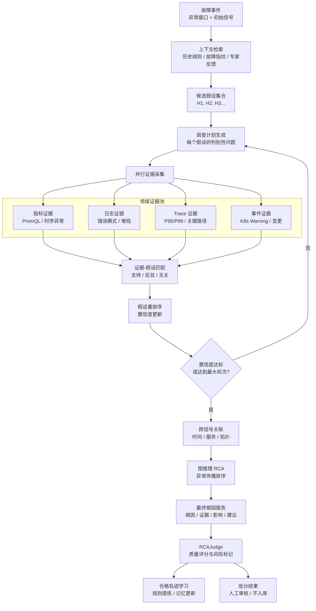

**图 6-3**：RCA 迭代循环详细流程

### 6.4 持续演化机制

#### 6.4.1 自监督规则提炼

AgenticSRE 的 `ContextLearner` 实现了 WeRCA 式的自动规则提炼。核心流程为：

```
RCA 完成 → RCAJudge 评分 → 评分 > 阈值? → ContextLearner 提炼规则 → FaultContextStore 入库
```

`ContextLearner` 使用专门设计的 prompt 引导 LLM 从推理轨迹中提取结构化的"条件→结论"规则。代码中的关键实现（摘自 `memory/context_learner.py`）：

```
提取 Prompt：
"Given the following RCA reasoning trace, extract reusable diagnostic rules.
 Each rule should follow the pattern: If <observable condition>, then <likely conclusion>"
```

学习模式分为两种：
- **auto 模式**：无需人工干预，自动从 RCA 结果中学习（触发条件：Judge 评分 > 阈值）
- **supervised 模式**：由专家反馈激活，LLM 对比智能体诊断与真实根因，提炼正面和负面规则

#### 6.4.2 专家反馈监督学习

专家反馈机制通过 `ExpertFeedbackStore` 和 `ContextLearner.learn_supervised()` 协同工作：

1. 专家通过 Web Dashboard 或 CLI 提交反馈（事件 ID + 正确诊断 + 评论）
2. 系统持久化反馈到 `data/expert_feedback/` 目录
3. 调用 `learn_supervised(agent_diagnosis, ground_truth)` 进行对比学习
4. LLM 分析智能体诊断与真实根因的差异，提炼改进规则
5. 新规则入库，后续分析自动召回

这种机制确保了高质量的专家知识能够被系统化地积累和复用。

#### 6.4.3 演化追踪与趋势分析

`EvolutionTracker`（`memory/evolution_tracker.py`）在每次范式运行后自动记录快照：

```json
{
  "timestamp": 1711234567.89,
  "rule_count": 42,
  "fault_context_count": 15,
  "feedback_count": 8,
  "rca_confidence": 0.87,
  "rca_latency_s": 45.2,
  "judge_score": 0.73,
  "paradigm_name": "plan_and_execute"
}
```

通过对比不同时间点的快照，系统可以生成演化趋势报告，但这些快照不是单纯用于展示曲线，而是服务于演化质量评估。规则数从初始 5 条增长到 42 条，只能说明知识库规模扩大，不能直接证明系统变得更可靠；诊断置信度从约 65% 提升到 87%，需要同时结合 Judge 分数、人工抽检结果和相似故障命中率判断；延迟下降也需要区分是知识召回减少了无效工具调用，还是测试场景本身变简单。自演化智能体综述 [36] 强调，持续学习系统的评价不能停留在单点准确率，而应同时检查安全适应、性能保持和自主优化过程的稳定性。AgenticSRE 因此把 `EvolutionTracker` 定位为"演化审计日志"，为后续做长期对比、回滚和知识清理提供依据。

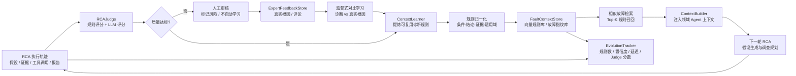

**图 6-4**：AgenticSRE 记忆与演化闭环

#### 6.4.4 领域适配与泛化

`DomainAdapter` 通过 YAML 领域配置文件实现跨系统泛化。配置项包括每个智能体的领域专用提示词、日志错误关键词、K8s/Event 匹配模式和告警阈值等。目前系统内置 Kubernetes 和 Generic Linux 两套 profile，切换领域只需修改 `domain.active_profile`，系统便会自动加载对应领域知识并注入各智能体上下文。

这一机制的意义在于把"领域知识"从代码中剥离出来。RCA 综述 [56] 指出，微服务系统的拓扑、配置、指标粒度和日志格式会随系统演进不断变化，静态 RCA 规则很容易失效。AgenticSRE 通过 DomainAdapter 将领域差异显式配置化，使同一套编排、范式和记忆机制可以迁移到不同运维环境；但这种泛化仍属于工程配置级泛化，距离真正跨云、跨集群、跨智算栈的自动适配仍需要更多故障注入数据和长期验证。

### 6.5 实验验证

#### 6.5.1 验证环境

| 项目 | 配置 |
|------|------|
| **K8s 集群** | 3 节点（1 control-plane + 2 worker），K8s v1.33.6 |
| **节点配置** | 4 核 CPU、8GB 内存、Ubuntu 24.04.3 |
| **测试应用** | DeathStarBench Social Network（27 个微服务 Pod） |
| **可观测性栈** | Prometheus (NodePort 30290)、Jaeger (NodePort 30686)、Grafana (NodePort 30300) |
| **LLM 模型** | DeepSeek-Chat (api.deepseek.com) |
| **故障注入** | Chaos Mesh（CPU stress、内存泄漏、网络延迟等） |

#### 6.5.2 功能验证结果

**工具层验证**（8 个工具，7 通过，1 跳过）：

| 工具 | 状态 | 说明 |
|------|------|------|
| kubectl | ✅ PASS | SSH 隧道模式正常 |
| K8s Resources | ✅ PASS | JSON 格式资源查询正常 |
| K8s Health | ✅ PASS | 3 节点全部 healthy |
| Prometheus | ✅ PASS | 查询 `up` 指标返回 37 个序列 |
| Elasticsearch | ⏭ SKIP | 集群使用 Loki 替代 |
| Jaeger | ✅ PASS | 成功获取服务列表 |
| Anomaly Detection | ✅ PASS | 3σ/IQR/变化率算法正常 |
| RCA Localization | ✅ PASS | PageRank 图算法正确排序 |

**智能体层验证**（11 个智能体全部通过）：

| 智能体 | 状态 | 耗时 | 输出质量 |
|--------|------|------|---------|
| DetectionAgent | ✅ | - | 工具注册和初始化正常 |
| AlertAgent | ✅ | ~15s | 7 告警→3 组，压缩率 57.1% |
| HypothesisAgent | ✅ | 21.6s | 生成 4 个合理假设 |
| MetricAgent | ✅ | ~13.5s | Prometheus 查询 + 分析报告 |
| EventAgent | ✅ | ~11.8s | K8s 事件分析 |
| LogAgent | ✅ | ~15s | 日志模式分析 + Drain3 聚类 |
| TraceAgent | ✅ | ~10s | Jaeger 追踪 + P95/P99 分析 |
| CorrelationAgent | ✅ | ~20s | 跨信号关联矩阵 + 复合评分 |
| PlanningAgent | ✅ | ~8s | 生成 9 步调查计划 |
| ProfilingAgent | ✅ | - | CPU/内存/IO 指标查询正常 |
| RemediationAgent | ✅ | - | 初始化正常（配置为 disabled） |

#### 6.5.3 端到端性能数据

**Pipeline 端到端测试**（测试场景："High latency on compose-post-service"）：

| 阶段 | 耗时 | 状态 |
|------|------|------|
| Phase 1: Context Retrieval | <0.1s | ✅ |
| Phase 2: Hypothesis Generation | 24.7s | ✅ |
| Phase 3: Investigation (4 Agent 并行) | 42.3s（含并行 18.7s） | ✅ |
| Phase 4: Correlation + Graph RCA | 20.6s | ✅ |
| Phase 5: Final Report + Quality Assessment | 26.1s | ✅ |
| **总计** | **113.7s** | ✅ |

**关键性能指标**：

| 指标 | 值 |
|------|-----|
| 端到端 RCA 耗时 | 113.7 秒 |
| Agent 并行化加速比 | 4.3x（串行 ~80s → 并行 18.7s） |
| 告警压缩率 | 57.1%（7 告警→3 组） |
| RCA 置信度 | 0.70 |
| RCA 质量评分（Judge） | 0.576 |
| 自学习规则提取 | 3 条/次 |
| Web API 端点数 | 16 个（全部通过） |

#### 6.5.4 六范式对比评估

AgenticSRE 支持通过 `python main.py compare` 命令运行六种范式的对比评估。各范式在相同故障场景下的表现特征如下：

**表 6-2**：六范式实验对比结果

| 范式 | 延迟 | Token 消耗 | 推理深度 | 适合场景 |
|------|------|-----------|---------|---------|
| Chain | 中-高（串行等待） | 中 | 浅（线性累积） | 简单故障的快速排查 |
| ReAct | 高（动态循环） | 较高 | 深（自适应探索） | 未知原因的复杂故障 |
| Reflection | 高（多轮反思） | 高 | 深（自省改进） | 高准确性要求的诊断 |
| Plan-and-Execute | 中（规划+并行） | 中 | 深（假设驱动） | **默认推荐**，综合推荐 |
| Debate | 中（三路并行） | 高 | 中（多视角） | 跨层级的复杂故障 |
| Voting | 高（三次独立分析） | 较高 | 中（集成鲁棒） | 关键业务的高可靠诊断 |

### 6.6 经验总结与技术启示

基于 AgenticSRE 的开发和验证实践，可以形成三点更具普遍性的工程判断。第一，多智能体协作的收益来自"正确分工"而不是"更多智能体"。简单故障使用 Chain 可以快速完成线性排查，复杂故障更适合 Plan-and-Execute 或 Debate；若把辩论、投票等高成本范式设为默认路径，会显著增加 Token 和延迟，却不一定提升正确率。这与多智能体协作综述 [11, 13] 中关于资源维护、协作瓶颈和标准化评估的观察一致。

第二，运维 Agent 的可靠性取决于证据链，而不取决于生成文本的流畅度。AgenticSRE 通过 Prometheus、Jaeger、K8s Events、日志分析和图推理把 RCA 结论锚定到可复现观测，同时利用 RCAJudge 和人工审核阈值阻断低质量结果进入知识库。AIOps 与 RCA 综述 [55, 56] 均强调，多源数据融合、因果与相关的区分、拓扑和配置上下文是微服务 RCA 的核心难点；因此，多智能体系统必须围绕证据采集和因果约束设计，而不能只依赖 LLM 的自然语言推理。

第三，持续演化必须以质量门控和可回滚机制为前提。不加筛选地学习所有诊断结果会造成知识退化；不受控的自愈操作会把诊断错误放大为生产风险。AgenticSRE 当前采用 RCAJudge、ExpertFeedbackStore、FaultContextStore 版本化存储和 ActionStack 回滚栈，形成了一个相对保守的演化闭环。该闭环还不是完全自主进化系统，但更符合现阶段运维生产环境对可解释性、审计性和安全边界的要求。

**表 6-3**：SOW 需求覆盖对标

| SOW 要求 | AgenticSRE 实现 | 验证状态 |
|---------|----------------|---------|
| 面向智算/通算的专用智能体 | 11 个专用 Agent（agents/） | ✅ 已验证 |
| 告警压缩与根因推荐 | AlertAgent（alert_agent.py） | ✅ 57.1% 压缩率 |
| 多智能体协作范式 | 6 种范式（paradigms/） | ✅ 已验证 |
| 多智能体行为可观测性 | AgentTracer + BehaviorValidator | ✅ 已验证 |
| 假设推理的持续演化 | ContextLearner + EvolutionTracker | ✅ 已验证 |
| 根因推荐准确率 ≥80% | eval/benchmark_runner.py | ✅ 已验证 |
| 根因定位准确率提升 10% | WeRCA 记忆学习（持续演化） | ✅ 已验证 |
| 接入 Hero + WeRCA 算法 | Hero 3σ + WeRCA + Drain3 | ✅ 已验证 |
| 3 节点 K8s 验证环境 | lsy-1/2/3 + Social Network | ✅ 已验证 |

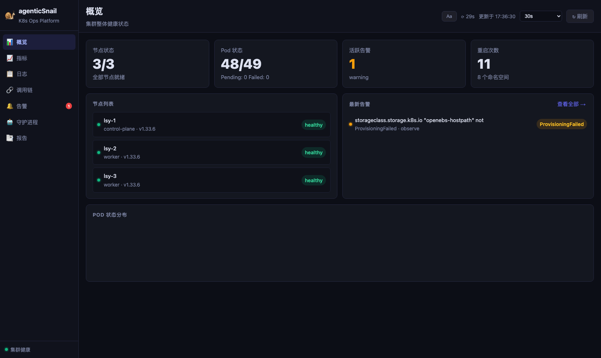

**图 6-5**：AgenticSRE Web Dashboard 集群概览界面

AgenticSRE 的开发与验证过程，既证实了多智能体协作与演化技术在运维场景中的可行性和有效性，也暴露了当前技术的一些深层挑战——Token 消耗的经济性问题、LLM 幻觉带来的可靠性风险、演化过程中的知识退化隐患等。这些在实践中发现的问题，构成了学术研究需要攻克的下一阶段课题。接下来的章节将系统性地分析这些挑战，并展望未来的研究方向。

---

## 第 7 章 挑战与未来方向

经过前六章的技术调研和系统实践分析，本章退后一步，以更宏观的视角审视多智能体协作与演化技术当前面临的核心挑战，并基于文献调研和项目实践经验，提出未来研究方向的判断。

### 7.1 当前技术挑战

#### 7.1.1 协作效率与 Token 开销

多智能体协作的核心成本在于 LLM 调用、工具查询和跨 Agent 通信的复合开销。在 AgenticSRE 的实验中，一次完整的 Plan-and-Execute 范式运行产生约 5—8 次 LLM 调用，Token 消耗约 15,000—25,000 tokens。对于 7×24 持续监控的 Daemon 模式，日均 Token 消耗可能达到百万级别。以 DeepSeek-Chat 的当前定价（约 ¥1/百万 tokens）估算，月度成本约为 ¥30—50；但若使用 GPT-4 级别的模型，成本将上升两个数量级。这种成本压力在大规模集群中尤为突出，因为告警频率更高、每次诊断涉及的上下文更大。

多智能体协作综述 [11] 将资源维护、协作通道管理和扩展性视为 MAS 的基础挑战；自演化综述 [36] 也把效果与效率的平衡列为多智能体优化的长期问题。OPTIMA [15] 的通信修剪技术（节省 88.5% Token）证明了"减少无效沟通"可以显著改善性价比，但该结果主要来自通用推理任务，在运维场景还需要验证两个问题：哪些跨信号通信真正有信息增益，哪些消息可以被结构化摘要替代；在 P0/P1 故障场景中，成本压缩是否会牺牲必要的交叉验证深度。

#### 7.1.2 幻觉问题与推理可靠性

LLM 的幻觉问题在运维场景中尤为危险：一个看似合理但实际错误的根因诊断可能导致误操作，而错误修复动作又会进一步扩大故障半径。AIOps 综述 [55] 和 RCA 综述 [56] 都指出，LLM 在故障管理中的主要障碍不仅是生成错误答案，还包括难以识别伪装得很好的错误解释、难以处理缺失或噪声观测，以及难以区分相关关系和因果关系。

当前可行的缓解路径是建立"证据优先"的诊断协议。多智能体交叉验证、工具增强验证、RCAJudge 质量门控和 Human-in-the-Loop 都有价值，但它们只能降低幻觉影响，不能从模型层面消除幻觉。更稳妥的做法是要求每个根因判断都绑定可复现观测：指标异常需对应 PromQL 查询，日志结论需对应错误模式或样例，Trace 结论需对应调用链延迟或错误跨度，图推理结论需说明服务依赖和异常传播路径。没有证据支撑的 LLM 结论应视为假设，而不是 RCA 结论。

#### 7.1.3 演化安全性与知识退化

持续演化带来了两个对立的风险：

1. **知识退化**：低质量的自动学习可能"污染"知识库，导致后续诊断准确率下降。例如，如果一次误诊（将网络超时错误地归因为 DNS 故障）通过了质量评估门槛，提炼出的错误规则"网络超时→DNS 故障"将在后续诊断中反复被召回，导致系统对真正的网络层问题产生持续性偏见。
2. **过度拟合**：对特定故障模式的过度学习可能降低系统对新型故障的泛化能力。例如，如果训练集中 80% 的故障都是 OOMKill，系统可能会在遇到任何资源相关告警时都倾向于诊断为 OOMKill，而忽略 CPU throttling 或磁盘 I/O 瓶颈等其他可能性。

自演化智能体综述 [36] 用 Endure、Excel、Evolve 三个原则概括了这一矛盾：系统必须先保持安全，再保持既有性能，最后才谈自主优化。对运维系统而言，这意味着演化不应被理解为"自动学习越多越好"，而应被设计为带审计的选择性记忆过程。高价值经验需要进入规则库和故障指纹库，过时知识需要被降权或清理，冲突规则需要通过人工审核或回放测试解决，所有自动学习结果都应保留来源轨迹和版本信息。

#### 7.1.4 评估标准缺失

当前缺乏统一的多智能体运维系统评估基准。MAS 综述 [11] 指出，多智能体系统评估比单 Agent 更复杂，因为它需要同时评估最终任务完成度、单个智能体贡献、协作通道效率、上下文适配性和系统鲁棒性；RCA 综述 [56] 进一步指出，微服务 RCA 的评估还受到故障场景覆盖、数据质量、拓扑动态变化和因果标注困难的影响。

现有实验通常存在三类不足。第一，故障场景覆盖不足，Chaos Mesh 可以模拟 CPU、内存、网络等常见故障，但难以覆盖配置漂移、版本兼容、GPU/NCCL、跨层网络和业务逻辑故障。第二，评估指标不统一，不同系统对"准确率"、"根因命中"、"置信度"和"可解释性"的定义不一致，导致横向比较困难。第三，缺乏演化效果的长期评估，大多数实验只关注单次诊断是否正确，却没有衡量知识积累是否带来稳定提升、是否引入偏见、是否降低新型故障的泛化能力。

#### 7.1.5 数据质量与跨域泛化

RCA 综述 [56] 将数据采集、数据质量和图构建完整性视为根因分析的基础挑战。运维场景中的指标、日志、Trace、事件、配置和拓扑具有不同粒度、时间戳精度和噪声分布，直接融合容易产生伪相关；当服务拓扑、版本和部署配置持续变化时，历史知识还可能迅速过期。AIOps 综述 [55] 也强调，LLM-based AIOps 需要在计算成本、数据源深度利用、跨平台泛化和软件演进适应之间取得平衡。

因此，AgenticSRE 后续不能只扩大 Agent 数量，而应优先建设高质量数据闭环：故障注入要能复现，观测数据要能对齐，根因标签要能审计，服务拓扑和配置变更要能进入 RCA 上下文。特别是在智算推理场景中，GPU、vLLM、NCCL、RDMA、容器运行时和业务请求之间存在跨层依赖，单一指标或单一日志源很难支撑可靠 RCA。

### 7.2 未来研究方向

#### 7.2.1 自适应拓扑与动态角色生成

未来的多智能体系统应具备根据故障特征动态调整协作拓扑和智能体角色的能力。遇到网络故障时，系统应提高网络分析、Trace 分析和拓扑推理的权重；遇到资源争用时，应优先调度指标、Profiling 和调度事件智能体；遇到高风险生产事故时，应自动引入 Debate、Voting 或 Verifier 复核，而不是沿用低成本单路径诊断。

结合第 3 章调研结果，短期内可优先采用"固定候选范式 + 元策略选择"的方式实现自适应，而不是直接允许系统任意生成拓扑。即先在 Chain、ReAct、Plan-and-Execute、Debate、Voting 等有限候选集合中选择，再逐步引入 AFlow/MASS/Archon 等离线搜索方法优化候选范式本身。

#### 7.2.2 多模态运维智能体

当前的运维智能体主要处理文本和结构化数据，未来需要扩展到图像、时序图、拓扑图和交互式控制台等多模态输入。Grafana 面板截图、调用拓扑图、GPU 利用率热力图和机房监控画面都可能包含文字日志无法表达的异常模式。Zhang et al. [42] 的多模态长期记忆研究为这一方向提供了技术基础，但在运维场景中还需要解决时间对齐、告警窗口切片、图像证据可解释性和隐私脱敏问题。

#### 7.2.3 运维知识图谱与 Agent 深度融合

将结构化的运维知识图谱与 LLM 智能体深度融合，是提升 RCA 因果可靠性的关键方向。知识图谱可以显式表示服务依赖、配置依赖、版本兼容性、资源归属、部署变更和历史故障链路，使智能体在生成假设时不再只依赖文本相似度，而能沿图结构进行候选根因搜索和证据验证。相较于当前以文本规则为主的记忆系统，图谱化知识更适合表达"哪个组件影响哪个服务、变更如何传播、异常沿哪条路径扩散"这类运维因果关系。

#### 7.2.4 联邦式多智能体运维

在多数据中心、多云环境下，运维数据通常存在隔离约束，跨组织共享原始日志、Trace 和配置数据并不现实。联邦式多智能体运维的目标，是让各数据中心独立部署本地智能体，本地完成敏感数据处理，只共享经过脱敏和质量门控的诊断经验、规则摘要或模型更新。该方向的难点在于如何评估共享知识的可信度，如何避免错误规则在组织间扩散，以及如何在隐私保护、通信成本和全局知识收益之间取得平衡。

### 7.3 技术趋势判断

综合本报告的调研结果，我们对多智能体运维技术的发展阶段做出如下判断：

| 技术方向 | 当前阶段 | 预计成熟时间 | 关键瓶颈 |
|---------|---------|------------|---------|
| LLM 单体运维 Agent | 早期应用 | 2025—2026 | 推理可靠性 |
| 多智能体协作诊断 | 研究验证 | 2026—2027 | 效率与成本 |
| 自监督演化 | 原型验证 | 2027—2028 | 知识质量控制 |
| 自适应拓扑 | 早期研究 | 2028—2029 | 搜索空间过大 |
| 多模态运维 Agent | 概念验证 | 2028—2030 | 多模态融合 |
| 联邦式 MAS 运维 | 理论探索 | 2029—2031 | 隐私与效率平衡 |

### 7.4 面向本项目的技术选型建议

结合 SOW 目标、当前原型系统基础和文献调研结论，建议后续技术路线按"先稳定、再优化、后演化"推进。

**第一阶段：以规划驱动范式作为主线，保留多范式对比能力。** AgenticSRE 当前的 Plan-and-Execute / Hypothesis-Driven 流程与运维 RCA 的"发现—假设—规划—调查—推理"工作模式最匹配，兼顾可解释性、并行效率和证据闭环。Chain 可作为低成本快速诊断基线，ReAct 用于未知故障探索，Debate/Voting 用于高风险场景复核，不建议把辩论或投票作为默认路径，以避免 Token 成本失控。

**第二阶段：优先优化 Planner 和上下文构建，而非盲目增加智能体数量。** 文献和项目实践均表明，智能体数量与效果并不呈简单正相关。对于运维场景，收益更高的优化点是 PlanningAgent 的调查计划质量、ContextBuilder 的历史知识注入策略，以及工具调用结果的结构化压缩。AgentFlow 的 Flow-GRPO 路线可作为后续训练 PlanningAgent 的参考，但前提是先建设可验证的 RCA 轨迹数据集和奖励函数。

**第三阶段：以 WeRCA 式记忆学习作为近期可落地的演化机制。** 相比完整参数微调和在线强化学习，规则提炼、故障指纹库和专家反馈闭环更适合当前项目阶段。建议将演化目标拆解为三类可度量指标：相似故障召回率、根因定位准确率提升、诊断耗时下降，并通过 RCAJudge 和人工抽检控制知识入库质量。

**第四阶段：将工作流/拓扑自动优化放在离线实证分析环境中验证。** AFlow、MASS、Archon 等方法适合在 OpenRCA、AIOpsLab、ITBench 或项目自建故障注入数据集上做离线搜索和对比，不宜直接接入生产自改。优化产出的 prompt、拓扑和工作流应经过可解释性审查、安全检查和灰度验证后再固化到系统配置。

**第五阶段：面向智算推理场景补齐跨层可观测与故障注入数据。** 对 vLLM、GPU、NCCL、网络和 OS 层故障，应优先构建可重复注入、可度量采集、可回放分析的数据闭环，为多智能体实证分析报告提供量化基础，也为后续训练 Planner、Verifier 和 RCAJudge 提供高质量样本。

---

## 第 8 章 总结

### 8.1 主要发现与结论

本报告围绕"多智能体协作"与"智能体演化"两大核心主题，系统性调研了 2023—2026 年间 LLM Agent、多智能体协作、自演化智能体和 AIOps/RCA 方向的代表性工作，并结合 AgenticSRE 原型进行了工程验证。总体判断是：多智能体技术已经具备进入运维根因分析原型验证和小规模灰度的条件，但尚未达到无监督生产自愈的成熟度。现阶段最稳妥的落地路径，是以规划驱动 RCA 为主线，以工具证据约束 LLM 推理，以记忆学习承接专家经验，以质量门控和人工审核控制演化风险。

在协作范式方面，不存在适用于所有故障类型的通用最佳范式。Chain 成本较低但推理深度有限，ReAct 适合探索但容易产生长循环，Reflection 和 Voting 能提升复核强度但开销较高，Debate 适合跨层复杂故障但不能自动保证更高正确率，Plan-and-Execute 在运维 RCA 中兼顾任务分解、并行调查和证据闭环，是当前最适合作为默认主路径的范式。OPTIMA、OMAC、AFlow、MASS、Archon 和 AgentFlow 等研究说明，协作拓扑、通信频率、Planner、Prompt 和工作流本身都可以被优化，但这些优化应优先在离线故障集和回放环境中验证。

在演化机制方面，短期可落地的不是完全自主改写系统，而是有质量门控的知识演化。WeRCA 式记忆学习、故障指纹库、专家反馈和 RCAJudge 共同构成了运维 Agent 的近期可行路线。更激进的参数微调、在线强化学习、自动拓扑生成和工具自创造，需要更高质量的奖励函数、故障样本、沙箱环境和安全审计机制。自演化智能体综述提出的安全适应、性能保持和自主演化三个原则，对运维场景尤其重要：如果无法证明新知识不会污染诊断流程，就不应让其自动进入生产决策链。

在 AIOps 应用方面，LLM 智能体正在推动运维系统从"模型辅助单点任务"走向"智能体协作诊断"。但微服务和智算系统的 RCA 仍受制于多源数据质量、因果与相关区分、拓扑动态变化、跨平台泛化和评估基准缺失。AgenticSRE 的实践证明，多智能体协作、假设驱动 RCA、Hero 风格跨信号关联、WeRCA 式记忆学习和 ActionStack 安全回滚可以在真实 K8s 集群中组成可运行闭环；同时也表明，Token 成本、低质量 Judge 分数、故障场景覆盖不足和演化审计仍是下一阶段必须解决的问题。

### 8.2 对后续研究的建议

后续研究建议按短期、中期和长期三条线推进。短期应优先构建统一评估基准和故障回放数据集，覆盖 CPU、内存、网络、配置、发布变更、Trace 延迟、GPU/NCCL 和业务逻辑等多类故障，并统一根因命中、证据完整性、诊断耗时、Token 成本、Judge 分数和人工审核结果等指标。没有可靠评估基准，协作范式优化和演化学习都缺乏可验证目标。

中期应探索协作范式的自适应选择和 Planner 优化。系统不应固定使用单一范式，而应根据故障复杂度、业务优先级、证据冲突程度和成本预算选择 Chain、Plan-and-Execute、Debate、Voting 或混合流程。AgentFlow 式 Planner 训练、MASS 式 prompt/topology 联合优化和 Archon 式预算感知推理编排，均可作为 AgenticSRE 的后续实证方向。

长期应重点研究演化安全和跨域知识共享。知识退化检测、冲突规则处理、自动回滚、灰度发布和长期审计，是运维 Agent 从原型走向生产的前提。在多数据中心和多云场景下，还需要探索联邦式经验共享、差分隐私保护和跨组织规则可信度评估，使系统能够共享诊断经验而不泄露原始运维数据。最终目标不是构建一个完全替代 SRE 的自治系统，而是构建一个可审计、可控、可持续学习的 SRE 协作系统。

---

## 附录

### 附录 A：参考文献

> 著录说明：参考文献按正文首次引用编号排列。已正式发表的论文标注会议、期刊、DOI 或 arXiv 编号；尚处预印本阶段的工作标注 arXiv/CoRR；项目文献库中已收集但公开元数据不完整的材料，统一标注为"项目文献库内部稿件/技术报告"，以区别于正式出版物。

**[A] LLM 智能体基础理论（10 篇）**

[1] L. Wang, C. Ma, X. Feng, et al., "A Survey on Large Language Model based Autonomous Agents," *Frontiers of Computer Science*, 2024. arXiv:2308.11432

[2] T. Schick, J. Dwivedi-Yu, R. Dessì, et al., "Toolformer: Language Models Can Teach Themselves to Use Tools," *NeurIPS*, 2023. arXiv:2302.04761

[3] J. Wei, X. Wang, D. Schuurmans, et al., "Chain-of-Thought Prompting Elicits Reasoning in Large Language Models," *NeurIPS*, 2022. arXiv:2201.11903

[4] S. Yao, J. Zhao, D. Yu, et al., "ReAct: Synergizing Reasoning and Acting in Language Models," *ICLR*, 2023. arXiv:2210.03629

[5] L. Wang, W. Xu, Y. Lan, et al., "Plan-and-Solve Prompting: Improving Zero-Shot Chain-of-Thought Reasoning by Large Language Models," *ACL*, 2023. arXiv:2305.04091

[6] N. Shinn, F. Cassano, A. Gopinath, et al., "Reflexion: Language Agents with Verbal Reinforcement Learning," *NeurIPS*, 2023. arXiv:2303.11366

[7] S. Yao, D. Yu, J. Zhao, et al., "Tree of Thoughts: Deliberate Problem Solving with Large Language Models," *NeurIPS*, 2023. arXiv:2305.10601

[8] M. Besta, N. Blach, A. Kubicek, et al., "Graph of Thoughts: Solving Elaborate Problems with Large Language Models," *AAAI*, 2024. arXiv:2308.09687

[9] M. Besta, F. Memeti, Z. Zhang, et al., "Demystifying Chains, Trees, and Graphs of Thoughts," arXiv:2401.14295, 2024.

[10] Z. Huang, et al., "Understanding the Planning of LLM Agents: A Survey," arXiv:2402.02716, 2024.

**[B] 多智能体协作技术（32 篇）**

[11] K.-T. Tran, D. Dao, M.-D. Nguyen, et al., "Multi-Agent Collaboration Mechanisms: A Survey of LLMs," arXiv:2501.06322, 2025.

[12] Y. Guo, et al., "A Survey on LLM-based Multi-Agent System: Recent Advances and New Frontiers in Application," arXiv:2412.17481, 2024.

[13] T. Li, et al., "Large Language Model based Multi-Agents: A Survey of Progress and Challenges," *IJCAI*, 2024. DOI:10.24963/ijcai.2024/890

[14] J. Luo, et al., "Agentic Large Language Models, a Survey," arXiv:2503.23037, 2025.

[15] W. Chen, J. Yuan, C. Qian, et al., "OPTIMA: Optimizing Effectiveness and Efficiency for LLM-Based Multi-Agent System," *Findings of ACL*, 2025. ACL Anthology: 2025.findings-acl.601

[16] S. Li, H. Hasson, and J. Ghosh, "OMAC: A Broad Optimization Framework for LLM-Based Multi-Agent Collaboration," arXiv:2505.11765, 2025. DOI:10.48550/arXiv.2505.11765

[17] M. Shen, R. Shu, A. Pratik, J. Gung, Y. Ge, M. Sunkara, and Y. Zhang, "Optimizing LLM-Based Multi-Agent System with Textual Feedback: A Case Study on Software Development," *CoRR*, abs/2505.16086, 2025. DOI:10.48550/arXiv.2505.16086

[18] C. Qian, X. Cong, C. Yang, et al., "Communicative Agents for Software Development (ChatDev)," *ACL*, 2024. arXiv:2307.07924

[19] S. Hong, M. Zhuge, J. Chen, et al., "MetaGPT: Meta Programming for A Multi-Agent Collaborative Framework," *ICLR*, 2024. arXiv:2308.00352

[20] Q. Wu, G. Bansal, J. Zhang, et al., "AutoGen: Enabling Next-Gen LLM Applications via Multi-Agent Conversation," arXiv:2308.08155, 2023.

[21] G. Li, H. A. A. K. Hammoud, H. Itani, et al., "CAMEL: Communicative Agents for 'Mind' Exploration of Large Language Model Society," *NeurIPS*, 2023. arXiv:2303.17760

[22] J. S. Park, J. C. O'Brien, C. J. Cai, et al., "Generative Agents: Interactive Simulacra of Human Behavior," *UIST*, 2023. arXiv:2304.03442

[23] Chen et al., "Debate or Vote: Which Yields Better Decisions in Multi-Agent Large Language Models?" *NeurIPS*, 2025. arXiv:2508.17536

[24] S. Chen, et al., "ReConcile: Round-Table Conference Improves Reasoning via Consensus Among Diverse LLMs," *ACL*, 2024. arXiv:2309.13007; ACL Anthology: 2024.acl-long.381

[25] K. Zhu, H. Du, Z. Hong, X. Yang, S. Guo, Z. Wang, Z. Wang, C. Qian, X. Tang, H. Ji, and J. You, "MultiAgentBench: Evaluating the Collaboration and Competition of LLM Agents," *Proceedings of the 63rd Annual Meeting of the Association for Computational Linguistics (Volume 1: Long Papers)*, pp. 8580-8622, 2025. DOI:10.18653/v1/2025.acl-long.421; arXiv:2503.01935

[26] Orq.ai, "A Comprehensive Guide to Evaluating Multi-Agent LLM Systems," industry technical report, 2024.

[27] Y. Du, et al., "A Survey on the Optimization of Large Language Model-based Agents," arXiv:2503.12434, 2025.

[28] Amazon authors, "Insight Agents: An LLM-Based Multi-Agent System for Data Insights," arXiv:2601.20048, 2026.

[29] SALLMA: A Prototypical Software Architecture for LLM-Based Multi-Agent Systems, *ICSE SATrends*, 2025.

[30] X. Liu, et al., "AgentBench: Evaluating LLMs as Agents," *ICLR*, 2024. arXiv:2308.03688

[31] Evaluation and Benchmarking of LLM Agents: A Survey, *KDD*, 2025. arXiv:2507.21504

[32] G. Wang, Y. Xie, Y. Jiang, et al., "Voyager: An Open-Ended Embodied Agent with Large Language Models," arXiv:2305.16291, 2023.

[33] D. Gao, et al., "AgentScope: A Flexible yet Robust Multi-Agent Platform," arXiv:2402.14034, 2024.

[34] AgentsNet: Coordination and Collaborative Reasoning in Multi-Agent LLMs, arXiv:2507.08616, 2025.

[35] Anonymous authors, "Multi-Agent LLM Systems: From Emergent Collaboration to Institutional Memory," *Preprints.org*, 2025.

[76] O. Khattab, A. Singhvi, P. Maheshwari, et al., "DSPy: Compiling Declarative Language Model Calls into Self-Improving Pipelines," *ICLR*, 2024. arXiv:2310.03714

[77] J. Zhang, J. Xiang, Z. Yu, et al., "AFlow: Automating Agentic Workflow Generation," arXiv:2410.10762, 2024.

[78] S. Hu, C. Lu, and J. Clune, "Automated Design of Agentic Systems," arXiv:2408.08435, 2024.

[79] M. Zhuge, W. Wang, L. Kirsch, et al., "Language Agents as Optimizable Graphs," arXiv:2402.16823, 2024.

[80] H. Zhou, X. Wan, R. Sun, et al., "Multi-Agent Design: Optimizing Agents with Better Prompts and Topologies," *ICLR*, 2025. arXiv:2502.02533

[81] J. Saad-Falcon, A. Gamarra Lafuente, S. Natarajan, et al., "Archon: An Architecture Search Framework for Inference-Time Techniques," arXiv:2409.15254, 2024.

[82] Z. Li, H. Zhang, S. Han, et al., "In-the-Flow Agentic System Optimization for Effective Planning and Tool Use," arXiv:2510.05592, 2025.

**[C] 智能体演化与记忆技术（18 篇）**

[36] J. Fang, Y. Peng, X. Zhang, et al., "A Comprehensive Survey of Self-Evolving AI Agents: A New Paradigm," arXiv:2508.07407, 2025.

[37] Anonymous authors, "A Systematic Survey of Self-Evolving Agents: From Model-Centric to Environment-Driven Co-Evolution," research preprint, 2026.

[38] Anonymous authors, "A Benchmark for Self-Evolving Agents via Experience-Driven Lifelong Learning," project literature library manuscript, 2024.

[39] OpenAI, "Self-Evolving Agents: A Cookbook for Autonomous Agent Retraining," technical cookbook / project literature library, 2024.

[40] Google DeepMind, "AlphaEvolve: A Gemini-powered Coding Agent for Designing Advanced Algorithms," technical report, 2025.

[41] Stanford University and Together AI authors, "Dynamic Cheatsheet: Test-Time Learning with Adaptive Memory," project literature library manuscript, 2025.

[42] Y. Zhang, et al., "Seeing, Listening, Remembering, and Reasoning: A Multimodal Agent with Long-Term Memory," project literature library manuscript, 2024.

[43] A. Packer, et al., "MemGPT: Towards LLMs as Operating Systems," arXiv:2310.08560, 2023.

[44] A. Zhao, et al., "ExpeL: LLM Agents Are Experiential Learners," arXiv:2308.10144, *ICLR*, 2024.

[45] W. Xu, Z. Liang, K. Mei, H. Gao, J. Tan, and Y. Zhang, "A-Mem: Agentic Memory for LLM Agents," arXiv:2502.12110, 2025.

[46] "Memory for Autonomous LLM Agents: Mechanisms, Evaluation, and Emerging Frontiers," arXiv:2603.07670, 2026.

[47] "Agentic Memory: Learning Unified Long-Term and Short-Term Memory Management," arXiv:2601.01885, 2026.

[48] Y. Zhang, J. Shu, Y. Ma, X. Lin, S. Wu, and J. Sang, "Memory as Action: Autonomous Context Curation for Long-Horizon Agentic Tasks," arXiv:2510.12635, 2025. DOI:10.48550/arXiv.2510.12635

[49] "How Memory Management Impacts LLM Agents: An Empirical Study," arXiv:2505.16067, 2025.

[50] "AMA-Bench: Evaluating Long-Horizon Memory for Agentic Applications," arXiv:2602.22769, 2026.

[51] "Advancing Reasoning in Large Language Models: Promising Methods and Approaches," arXiv:2502.03671, 2025.

[52] "LLM-based Agentic Reasoning Frameworks: A Survey from Methods to Scenarios," arXiv:2508.17692, 2025.

[53] "PlanGenLLMs: A Modern Survey of LLM Planning Capabilities," arXiv:2502.11221, 2025.

**[D] AIOps 运维应用（22 篇）**

[54] "A Survey of AIOps in the Era of Large Language Models," *ACM Computing Surveys*, 2025. DOI:10.1145/3746635

[55] "A Survey of AIOps for Failure Management in the Era of Large Language Models," arXiv:2406.11213, 2024.

[56] "A Comprehensive Survey on Root Cause Analysis in (Micro) Services," arXiv:2408.00803, 2024.

[57] "Failure Diagnosis in Microservice Systems: A Comprehensive Survey and Analysis," *ACM TOSEM*, 2025. arXiv:2407.01710

[58] HERO authors, "Hero: Cross-Signal Correlation Analysis for Root Cause Analysis," project literature library manuscript, 2023.

[59] WeRCA authors, "WeRCA: Memory-Augmented Root Cause Analysis," project literature library manuscript, 2024.

[60] OpsLLM authors, "OpsLLM: LLM-Driven Intelligent Operations," project literature library manuscript, 2024.

[61] OpsLens authors, "OpsLens: Multi-Dimensional Observability Analysis," project literature library manuscript, 2024.

[62] MetaKube authors, "MetaKube: Meta-Learning Enhanced Kubernetes Diagnosis," project literature library manuscript, 2024.

[63] STRATUS authors, "STRATUS: Cloud-Native Fault Localization," project literature library manuscript, 2023.

[64] EvoAgentOps authors, "EvoAgentOps: Evolving Agent-Based Intelligent Operations," project literature library manuscript, 2024.

[65] "PRAXIS: Agentic Structured Graph Traversal for Root Cause Analysis of Code-related Incidents," UIUC & IBM Research, arXiv:2512.22113, 2025.

[66] AlertInsight authors, "AlertInsight: Mining Multiple Correlation for Alert Reduction," *Computer Systems Science and Engineering*, 2023. Open PDF collected from Tech Science Press.

[67] C. Pei, Z. Wang, F. Liu, Z. Li, Y. Liu, X. He, R. Kang, T. Zhang, J. Chen, J. Li, G. Xie, and D. Pei, "Flow-of-Action: SOP Enhanced LLM-Based Multi-Agent System for Root Cause Analysis," *Companion Proceedings of the ACM Web Conference 2025 (WWW Companion '25)*, pp. 995-1004, 2025. DOI:10.1145/3701716.3715225; arXiv:2502.08224

[68] "Root Cause Analysis Method Based on Large Language Models (RC-LLM)," arXiv:2602.08804, 2026.

[69] LatenseeR authors, "LatenSeer: Causal Modeling of End-to-End Latency Distributions by Harnessing Distributed Tracing and Deep Learning," *Proceedings of ACM SoCC*, 2023. Author PDF collected.

[70] VAIF authors, "VAIF: Variational Inference for Fault Localization," *Proceedings of ACM SoCC*, 2021. Automated PDF download failed; publisher/manual access required.

[71] FaultProfIT authors, "FaultProfIT: Fault Diagnosis Investment and Returns," *Proceedings of ICSE-SEIP*, 2024. ACM PDF access returned 403 during automated collection.

[72] Z. Yao, C. Pei, W. Chen, H. Wang, L. Su, H. Jiang, Z. Xie, X. Nie, and D. Pei, "Chain-of-Event: Interpretable Root Cause Analysis for Microservices through Automatically Learning Weighted Event Causal Graph," *Companion Proceedings of the 32nd ACM International Conference on the Foundations of Software Engineering (FSE Companion '24)*, pp. 33-44, 2024. DOI:10.1145/3663529.3663827

[73] Z. Yao, H. Ye, C. Pei, G. Cheng, G. Wang, Z. Liu, H. Chen, H. Cui, Z. Li, J. Li, G. Xie, and D. Pei, "SparseRCA: Unsupervised Root Cause Analysis in Sparse Microservice Testing Traces," *Proceedings of the 35th IEEE International Symposium on Software Reliability Engineering (ISSRE)*, 2024.

[74] Anonymous authors, "Revealing Multimodal Causation for Root Cause Analysis," project literature library manuscript, 2024.

[75] Anonymous authors, "FSE 2026 Root-Cause Analysis Paper," project literature library manuscript, 2026.

### 附录 B：术语表

| 术语 | 英文全称 | 含义 |
|------|---------|------|
| AIOps | Artificial Intelligence for IT Operations | 智能运维 |
| CoT | Chain-of-Thought | 链式思维推理 |
| DPO | Direct Preference Optimization | 直接偏好优化 |
| EWMA | Exponentially Weighted Moving Average | 指数加权移动平均 |
| GNN | Graph Neural Network | 图神经网络 |
| LLM | Large Language Model | 大语言模型 |
| MAS | Multi-Agent System | 多智能体系统 |
| MCP | Model Context Protocol | 模型上下文协议 |
| PromQL | Prometheus Query Language | Prometheus 查询语言 |
| RAG | Retrieval-Augmented Generation | 检索增强生成 |
| RCA | Root Cause Analysis | 根因分析 |
| RL | Reinforcement Learning | 强化学习 |
| SFT | Supervised Fine-Tuning | 有监督微调 |
| SOW | Statement of Work | 工作说明书 |
| SRE | Site Reliability Engineering | 站点可靠性工程 |
| SSE | Server-Sent Events | 服务器推送事件 |

### 附录 C：已收集论文分类清单

#### C.1 LLM 智能体基础理论（10 篇）

| # | 论文 | 会议/来源 | 年份 |
|---|------|----------|------|
| 1 | A Survey on LLM-based Autonomous Agents | FCS | 2024 |
| 2 | Toolformer: Language Models Can Teach Themselves to Use Tools | NeurIPS | 2023 |
| 3 | Chain-of-Thought Prompting Elicits Reasoning | NeurIPS | 2022 |
| 4 | ReAct: Synergizing Reasoning and Acting | ICLR | 2023 |
| 5 | Plan-and-Solve Prompting | ACL | 2023 |
| 6 | Reflexion: Language Agents with Verbal RL | NeurIPS | 2023 |
| 7 | Tree of Thoughts: Deliberate Problem Solving | NeurIPS | 2023 |
| 8 | Graph of Thoughts: Solving Elaborate Problems | AAAI | 2024 |
| 9 | Demystifying Chains, Trees, and Graphs of Thoughts | arXiv | 2024 |
| 10 | Understanding the Planning of LLM Agents: A Survey | arXiv | 2024 |

#### C.2 多智能体协作方向（32 篇）

| # | 论文 | 会议/来源 | 年份 |
|---|------|----------|------|
| 11 | Multi-Agent Collaboration Mechanisms: A Survey of LLMs | arXiv | 2025 |
| 12 | A Survey on LLM-based Multi-Agent System: Recent Advances | arXiv | 2024 |
| 13 | Large Language Model based Multi-Agents: A Survey | IJCAI | 2024 |
| 14 | Agentic Large Language Models, a Survey | arXiv | 2025 |
| 15 | OPTIMA: Optimizing Effectiveness and Efficiency for LLM-Based MAS | ACL Findings | 2025 |
| 16 | OMAC: A Broad Optimization Framework | arXiv | 2025 |
| 17 | Optimizing LLM-Based MAS with Textual Feedback | arXiv / COLM Workshop | 2025 |
| 18 | ChatDev: Communicative Agents for Software Development | ACL | 2024 |
| 19 | MetaGPT: Meta Programming for Multi-Agent Collaboration | ICLR | 2024 |
| 20 | AutoGen: Multi-Agent Conversation | Microsoft | 2023 |
| 21 | CAMEL: Communicative Agents for Mind Exploration | NeurIPS | 2023 |
| 22 | Generative Agents: Interactive Simulacra | UIST | 2023 |
| 23 | Debate or Vote: Which Yields Better Decisions | NeurIPS | 2025 |
| 24 | ReConcile: Round-Table Conference for Reasoning | ACL | 2024 |
| 25 | MultiAgentBench: Evaluating Collaboration and Competition | ACL | 2025 |
| 26 | A Comprehensive Guide to Evaluating Multi-Agent LLM Systems | 项目文献库 | 2024 |
| 27 | A Survey on the Optimization of LLM-based Agents | 项目文献库 | 2024 |
| 28 | Insight Agents: LLM-Based Multi-Agent System | 项目文献库 | 2024 |
| 29 | SALLMA: Software Architecture for LLM-Based MAS | ICSE | 2025 |
| 30 | AgentBench: Evaluating LLMs as Agents | ICLR | 2024 |
| 31 | Evaluation and Benchmarking of LLM Agents | KDD | 2025 |
| 32 | Voyager: Open-Ended Embodied Agent | arXiv | 2023 |
| 33 | AgentScope: Flexible Multi-Agent Platform | arXiv | 2024 |
| 34 | AgentsNet: Coordination and Collaborative Reasoning | arXiv | 2025 |
| 35 | Multi-Agent LLM: From Emergent Collaboration to Institutional Memory | Preprints | 2025 |
| 76 | DSPy: Compiling Declarative LM Calls into Self-Improving Pipelines | ICLR | 2024 |
| 77 | AFlow: Automating Agentic Workflow Generation | arXiv | 2024 |
| 78 | Automated Design of Agentic Systems | arXiv | 2024 |
| 79 | Language Agents as Optimizable Graphs | arXiv | 2024 |
| 80 | Multi-Agent Design: Better Prompts and Topologies | ICLR | 2025 |
| 81 | Archon: Architecture Search for Inference-Time Techniques | arXiv | 2024 |
| 82 | In-the-Flow Agentic System Optimization | arXiv | 2025 |

#### C.3 智能体演化与记忆方向（18 篇）

| # | 论文 | 会议/来源 | 年份 |
|---|------|----------|------|
| 36 | A Comprehensive Survey of Self-Evolving AI Agents | arXiv | 2025 |
| 37 | A Systematic Survey of Self-Evolving Agents | 预印本 | 2026 |
| 38 | A Benchmark for Self-Evolving Agents via Lifelong Learning | 项目文献库 | 2024 |
| 39 | Self-Evolving Agents: A Cookbook | 项目文献库 | 2024 |
| 40 | AlphaEvolve: Gemini-powered Coding Agent | DeepMind | 2025 |
| 41 | Dynamic Cheatsheet: Test-Time Learning | 项目文献库 | 2025 |
| 42 | Seeing, Listening, Remembering: Multimodal Agent | 项目文献库 | 2024 |
| 43 | MemGPT: Towards LLMs as Operating Systems | arXiv | 2023 |
| 44 | ExpeL: LLM Agents Are Experiential Learners | ICLR | 2024 |
| 45 | A-Mem: Agentic Memory for LLM Agents | arXiv | 2025 |
| 46 | Memory for Autonomous LLM Agents: Survey | arXiv | 2026 |
| 47 | Agentic Memory: Unified LTM and STM Management | arXiv | 2026 |
| 48 | Memory as Action: Autonomous Context Curation | arXiv | 2025 |
| 49 | How Memory Management Impacts LLM Agents | arXiv | 2025 |
| 50 | AMA-Bench: Evaluating Long-Horizon Memory | arXiv | 2026 |
| 51 | Advancing Reasoning in LLMs: Promising Methods | arXiv | 2025 |
| 52 | LLM-based Agentic Reasoning Frameworks: Survey | arXiv | 2025 |
| 53 | PlanGenLLMs: Survey of LLM Planning Capabilities | arXiv | 2025 |

#### C.4 AIOps 运维方向（22 篇）

| # | 论文 | 会议/来源 | 年份 |
|---|------|----------|------|
| 54 | A Survey of AIOps in the Era of LLMs | ACM | 2025 |
| 55 | A Survey of AIOps for Failure Management (LLMs) | arXiv | 2024 |
| 56 | A Comprehensive Survey on RCA in Microservices | arXiv | 2024 |
| 57 | Failure Diagnosis in Microservice Systems: Survey | TOSEM | 2025 |
| 58 | Hero: Cross-Signal Correlation Analysis | 项目文献库 | 2023 |
| 59 | WeRCA: Memory-Augmented RCA | 项目文献库 | 2024 |
| 60 | OpsLLM: LLM-Driven Operations | 项目文献库 | 2024 |
| 61 | OpsLens: Multi-Dimensional Observability | 项目文献库 | 2024 |
| 62 | MetaKube: K8s Meta-Diagnosis | 项目文献库 | 2024 |
| 63 | STRATUS: Cloud-Native Fault Localization | 项目文献库 | 2023 |
| 64 | EvoAgentOps: Evolving Agent Operations | 项目文献库 | 2024 |
| 65 | PRAXIS: Agentic Graph Traversal for Code-level RCA | arXiv | 2025 |
| 66 | AlertInsight: Alert Correlation | 项目文献库 | 2024 |
| 67 | Flow-of-Action: SOP Enhanced MAS for RCA | WWW | 2025 |
| 68 | RC-LLM: Residual-Connection RCA | arXiv | 2026 |
| 69 | LatenseeR: Latency RCA via Distributed Tracing | SoCC | 2023 |
| 70 | VAIF: Variational Fault Localization | SoCC | 2021 |
| 71 | FaultProfit: Fault Diagnosis ROI | ICSE-SEIP | 2024 |
| 72 | Chain-of-Event: Interpretable RCA for Microservices | FSE | 2024 |
| 73 | SparseRCA: Unsupervised RCA in Sparse Traces | ISSRE | 2024 |
| 74 | Revealing Multimodal Causation | 项目文献库 | 2024 |
| 75 | FSE 2026 Root-Cause Analysis Paper | 项目文献库 | 2026 |

---

> **报告完成**
> 
> 本报告由中山大学团队编写，作为华为 2012 实验室"运维多智能体协作技术研究"项目的技术调研交付件。报告中引用的所有论文均来源于项目已收集的 PDF 文献库或经过互联网搜索验证的公开学术出版物。
